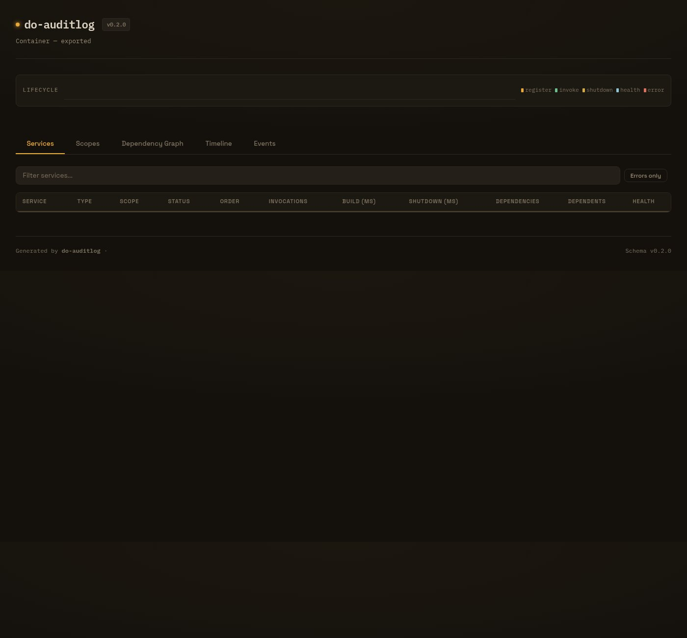
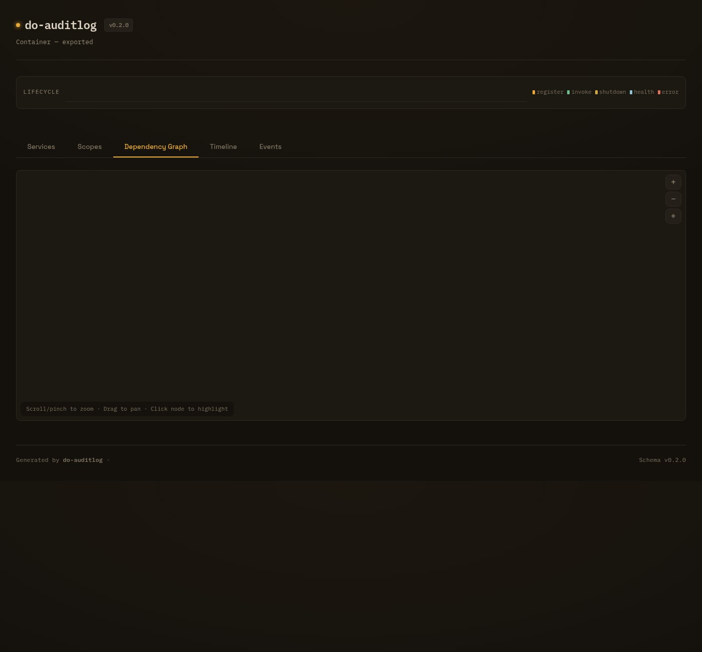
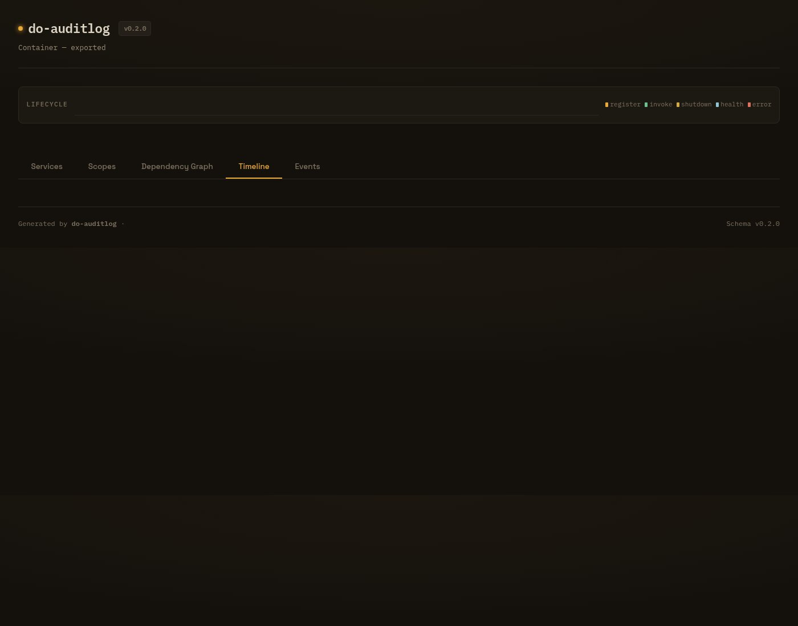
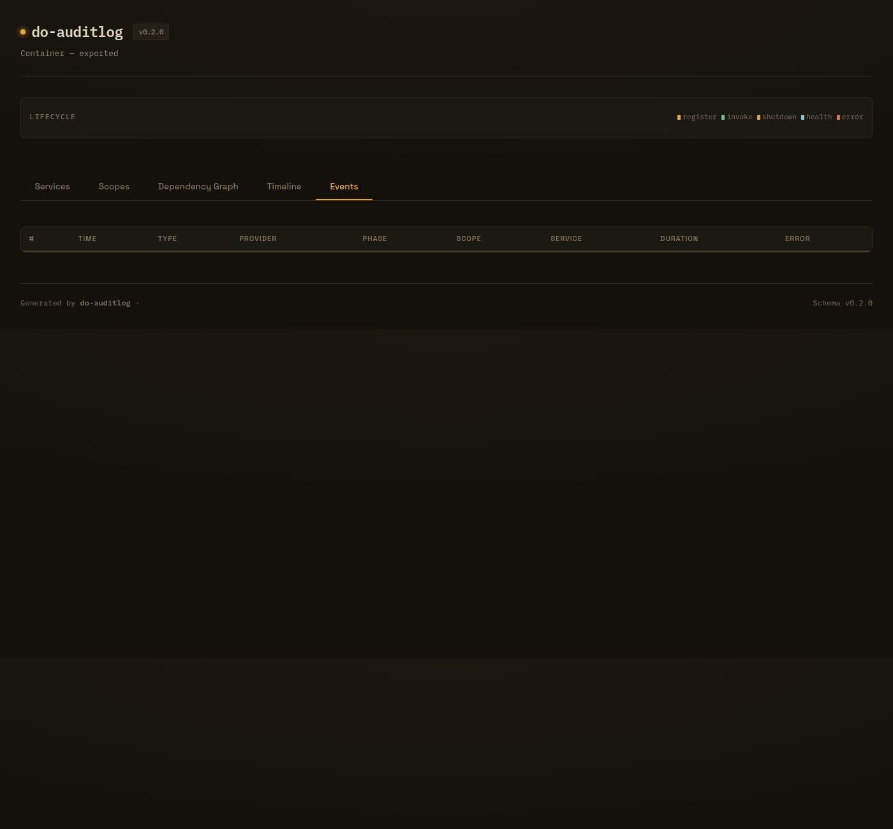
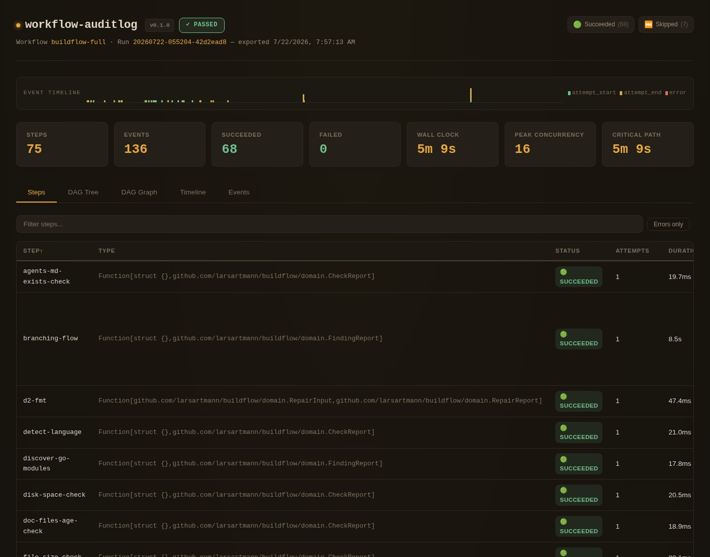
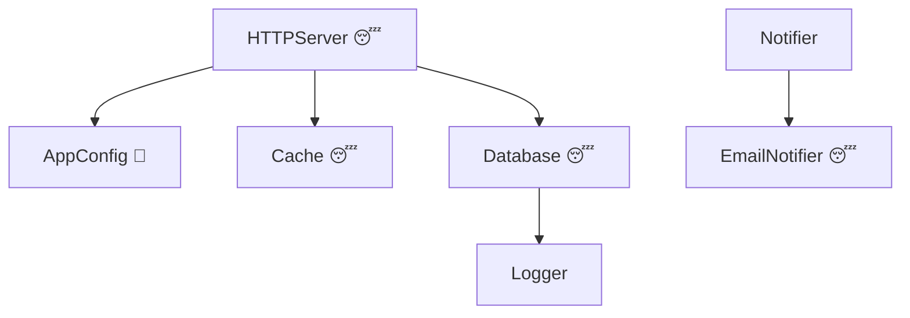

<div align="center">

# do-auditlog

**See every dependency, every event.**

Audit-log plugin for [samber/do v2](https://github.com/samber/do) — track every registration, invocation, and shutdown with timestamps, dependency graphs, and self-contained HTML visualization.

[](https://github.com/LarsArtmann/samber-do-auditlog/actions/workflows/ci.yml)
[](https://pkg.go.dev/github.com/larsartmann/samber-do-auditlog)
[](https://go.dev/dl/)
[](https://github.com/LarsArtmann/samber-do-auditlog/actions/workflows/ci.yml)
[](https://opensource.org/licenses/MIT)

[Documentation](https://do-auditlog.lars.software) &middot; [Quick Start](https://do-auditlog.lars.software/getting-started/quick-start/) &middot; [API Reference](https://do-auditlog.lars.software/api-reference/)

</div>

> [!CAUTION]
> **Alpha.** The API may change between releases. Pin to a specific commit if you use this in production. See [STABILITY.md](STABILITY.md) for the stability promise. Feedback welcome in [Issues](https://github.com/larsartmann/samber-do-auditlog/issues) — [CONTRIBUTING.md](CONTRIBUTING.md) has everything you need to get started.

---

## What does it look like?

A single self-contained HTML file. No server, no dependencies, no external requests.



<details>
<summary><b>More screenshots</b></summary>

<table>
<tr>
<td align="center"><b>Dependency Graph</b></td>
<td align="center"><b>Timeline</b></td>
</tr>
<tr>
<td></td>
<td></td>
</tr>
<tr>
<td align="center"><b>Events Stream</b></td>
<td align="center"><b>Real-World Usage</b></td>
</tr>
<tr>
<td></td>
<td></td>
</tr>
</table>

</details>

---

## Why?

samber/do v2 gives you lifecycle hooks but nothing to consume them. No recorder, no export, no visualization. You're flying blind.

**do-auditlog** wires into those hooks in one line and tells you:

- **What exists** — every service, when it was created, how long it took to build
- **What depends on what** — forward and reverse dependency graph, auto-inferred
- **What happened** — a complete chronological event stream with timestamps
- **What's healthy** — per-service health check results with error details
- **What the scope tree looks like** — full hierarchy with per-scope service lists

Then export the whole thing as JSON, NDJSON, or a self-contained HTML page you can open in any browser.

## Install

```bash
go get github.com/larsartmann/samber-do-auditlog
```

Requires Go 1.26+ and [samber/do v2](https://github.com/samber/do).

> **Try the demo:** `git clone` this repo and run `DO_AUDITLOG_ENABLED=true go run ./example` — 20 services across 4 scopes with health checks, shutdowns, and invocation errors.

## Quick Start

```go
package main

import (
    "os"

    auditlog "github.com/larsartmann/samber-do-auditlog"
    "github.com/samber/do/v2"
)

type Database struct{}

func main() {
    // 1. Create the plugin and pass hooks to the DI container
    plugin, err := auditlog.New(auditlog.Config{
        Enabled:     true,
        ContainerID: "my-app",
    })
    if err != nil {
        panic(err)
    }

    injector := do.NewWithOpts(plugin.Opts())

    // 2. Register and invoke services as usual
    do.Provide(injector, func(i do.Injector) (*Database, error) {
        return &Database{}, nil
    })
    do.MustInvoke[*Database](injector)

    // 3. Export — open in any browser
    plugin.ExportToHTML("audit.html")

    // Other formats:
    plugin.ExportToFile("audit.json")            // full JSON snapshot
    plugin.ExportEventsToNDJSON("events.ndjson") // streaming format
    plugin.Report().WriteMermaid(os.Stdout)      // paste into GitHub README
}
```

> [!TIP]
> **Toggle without code changes:** Set `Enabled: false` (the zero value) and control via the `DO_AUDITLOG_ENABLED=true` environment variable. Ship the plugin wired in production and flip the switch at deploy time — no code change, no recompile.

## Features

| Feature                  | What it gives you                                                                   |
| ------------------------ | ----------------------------------------------------------------------------------- |
| **Drop-in setup**        | `do.NewWithOpts(plugin.Opts())` — one line, zero config                             |
| **Dependency graph**     | Infers which service resolved which, without touching do's internal DAG             |
| **Reverse dependencies** | Every service knows who depends on it                                               |
| **Scope tree**           | Full hierarchy with per-scope service lists and cross-scope resolution              |
| **Service types**        | Auto-detects lazy / eager / transient / alias via `do.ExplainNamedService`          |
| **Timing**               | First build duration, shutdown duration, invocation count and order                 |
| **Health checks**        | Wraps `injector.HealthCheck()` with per-service audit events                        |
| **16+ export formats**   | JSON, NDJSON, CSV, TSV, HTML, Mermaid, PlantUML, DOT, D2, tree, table               |
| **Filtered reports**     | Slice by name, type, scope, event type, or time range before exporting              |
| **Real-time streaming**  | `OnEvent` callback fires on every event — stream to Prometheus, OTel, or dashboards |
| **Env var toggle**       | `DO_AUDITLOG_ENABLED=true` activates the plugin without code changes                |
| **Bounded memory**       | `MaxEvents` caps in-memory events; `DroppedEventCount()` tracks overflow            |
| **Report diffing**       | `Report.Diff(other)` detects added, removed, and changed services for CI/CD         |
| **~1.7 µs overhead**     | In-memory capture during operation. Toggle off for zero cost                        |
| **Minimal deps**         | `samber/do/v2` + `a-h/templ` + `larsartmann/go-output` (diagrams and tables)        |

## How It Works

The plugin hooks into samber/do's lifecycle callbacks. It does **not** access do's internal DAG. Instead, it uses a lightweight invocation stack to infer dependencies:

1. Service A's provider starts → A is pushed onto a stack
2. A calls `do.MustInvoke[B]` → B's hook fires while A is still on the stack
3. The plugin records: **A depends on B**
4. A's provider returns → A is popped from the stack

This correctly handles cached services, cross-scope resolution, and provider errors. The reverse graph (`Dependents`) is computed at report time.

## Export Formats

Every format is a single method call. All write to `io.Writer`; most have a matching `ExportTo*` file helper.

| Format                  | Method                              | Best for                                 |
| ----------------------- | ----------------------------------- | ---------------------------------------- |
| **HTML**                | `ExportToHTML(path)`                | Interactive 5-tab visualization, sharing |
| **JSON**                | `ExportToFile(path)`                | Full snapshot, programmatic analysis     |
| **NDJSON**              | `ExportEventsToNDJSON(path)`        | Streaming, log aggregators, replay       |
| **CSV / TSV**           | `ExportToCSV(path)` / `ExportToTSV` | Spreadsheets, data pipelines             |
| **Mermaid**             | `report.WriteMermaid(w)`            | Inline in GitHub, GitLab, Notion         |
| **PlantUML**            | `report.WritePlantUML(w)`           | IntelliJ, online editors                 |
| **DOT**                 | `report.WriteDOT(w)`                | Graphviz rendering                       |
| **D2**                  | `report.WriteD2(w)`                 | Modern diagram rendering                 |
| **ASCII Tree**          | `report.WriteTree(w)`               | Quick dependency overview in terminal    |
| **HTML Tree**           | `report.WriteHTMLTree(w)`           | Nested-list dependency tree              |
| **Table (16+ formats)** | `report.WriteTable(w, format, ...)` | Markdown, YAML, TOML, XML, and more      |

The Mermaid output renders natively on GitHub. Node labels include the provider-type emoji (😴 lazy, 🔁 eager, 🏭 transient):



<details>
<summary><b>JSON output shape</b> (click to expand)</summary>

Each service in the JSON report carries its full lifecycle data:

```json
{
  "service_name": "*main.HTTPServer",
  "scope_name": "[root]",
  "status": "shutdown",
  "service_type": "lazy",
  "invocation_count": 1,
  "first_build_duration_ms": 0.06,
  "shutdown_duration_ms": 0.003,
  "dependencies": [{ "service_name": "*main.Database" }, { "service_name": "*main.Cache" }],
  "health_check_count": 1
}
```

</details>

## Filtered Reports

Slice the report before exporting. Filters compose — pass multiple options to intersect them:

```go
// Only lazy services in the "drivers" scope
report := plugin.ReportFiltered(
    auditlog.WithServicesByType(auditlog.ProviderTypeLazy),
    auditlog.WithScope("drivers"),
)

// Only invocation events in the last 5 minutes
report = plugin.ReportFiltered(
    auditlog.WithEventsByType(auditlog.EventTypeInvocation),
    auditlog.WithTimeRange(time.Now().Add(-5*time.Minute), time.Now()),
)

// Export the filtered slice
plugin.ExportFilteredToFile("lazy.json",
    auditlog.WithServicesByType(auditlog.ProviderTypeLazy),
)
```

**Available filters:**

| Option                         | Filters by                                                    |
| ------------------------------ | ------------------------------------------------------------- |
| `WithServicesByName(names...)` | Service name(s)                                               |
| `WithServicesByType(type)`     | Provider type (lazy, eager, transient, alias)                 |
| `WithEventsByType(type)`       | Event type (registration, invocation, shutdown, health_check) |
| `WithTimeRange(from, to)`      | Event timestamp range                                         |
| `WithScope(scopeID)`           | Scope ID                                                      |

## Health Checks

samber/do v2 does not expose health-check hooks. do-auditlog wraps `injector.HealthCheck()` to record per-service audit events:

```go
result := plugin.RecordHealthCheck(injector)
report := plugin.Report()

if !report.HealthCheckSucceeded {
    for _, svc := range report.UnhealthyServices() {
        log.Printf("unhealthy: %s — %s", svc.ServiceName, *svc.HealthCheckError)
    }
}
```

## Real-Time Event Streaming

Pass an `OnEvent` callback to react to events as they happen — no polling, no background goroutines:

```go
plugin, err := auditlog.New(auditlog.Config{
    Enabled: true,
    OnEvent: func(ev auditlog.Event) {
        // Stream to Prometheus, OpenTelemetry, a live dashboard...
        log.Printf("event %d: %s %s", ev.Sequence, ev.EventType, ev.ServiceName)
    },
})
```

The callback fires **outside the mutex** on every event. Keep it fast.

## CLI Tool

Inspect, convert, diff, and validate reports from the command line:

```bash
go install ./cmd/auditlog

auditlog info report.json            # summary stats
auditlog convert report.json -f ndjson  # JSON → NDJSON
auditlog diff old.json new.json      # structural comparison
auditlog validate report.json        # schema validation
```

## Loading & Migrating Reports

Export a report, then load it back. `LoadReport` auto-detects JSON vs NDJSON:

```go
// Load any report file — JSON or NDJSON, v0.1.0 or v0.2.0 schema
report, format, err := auditlog.LoadReport("audit.json")
if err != nil {
    panic(err)
}
fmt.Printf("loaded %s: %d services, %d events\n", format, report.ServiceCount, report.EventCount)

// Migrate an old v0.1.0 report to the current schema
migrated, err := auditlog.MigrateReport(oldJSONBytes)

// Replay NDJSON events back into a full Report
events, err := auditlog.ReadEvents(ndjsonFile)
report, err := auditlog.ReplayEvents(events)

// Get the canonical JSON Schema for validation
schema := auditlog.JSONSchema()
```

## Performance

| Path     | Overhead | Allocs |
| -------- | -------- | ------ |
| Enabled  | ~1.7 µs  | 6      |
| Disabled | ~113 ns  | 4      |

In-memory capture — no file I/O during container operation. You pay the cost only when you export. Full benchmarks in [BENCHMARKS.md](BENCHMARKS.md).

## Security & Quality

| Signal                | Detail                                                             |
| --------------------- | ------------------------------------------------------------------ |
| **CSP hardened**      | HTML reports use `base-uri 'none'; frame-ancestors 'none'`         |
| **Fuzz tested**       | 5 fuzz targets covering HTML XSS, migration, diagrams, NDJSON      |
| **govulncheck**       | Runs on every CI push — zero known vulnerabilities                 |
| **109 linters**       | golangci-lint v2 with near-exhaustive linter set, zero exemptions  |
| **94% coverage gate** | CI fails if coverage drops below 94% of non-example/cmd statements |
| **JSON Schema**       | Canonical Draft 2020-12 schema generated from Go types             |

## Documentation

| Resource                                                                             | What you'll find                          |
| ------------------------------------------------------------------------------------ | ----------------------------------------- |
| [Quick Start](https://do-auditlog.lars.software/getting-started/quick-start/)        | From zero to HTML report in 60 seconds    |
| [Dependency Tracking](https://do-auditlog.lars.software/guides/dependency-tracking/) | How the invocation stack infers the graph |
| [Export Formats](https://do-auditlog.lars.software/guides/export-formats/)           | Every format with examples                |
| [Filtered Reports](https://do-auditlog.lars.software/guides/filtered-reports/)       | Slice by name, type, scope, time          |
| [Health Checks](https://do-auditlog.lars.software/guides/health-checks/)             | Per-service health audit events           |
| [Performance](https://do-auditlog.lars.software/guides/performance/)                 | Benchmarks and tuning                     |
| [API Reference](https://do-auditlog.lars.software/api-reference/)                    | Full API docs with examples               |
| [pkg.go.dev](https://pkg.go.dev/github.com/larsartmann/samber-do-auditlog)           | Generated godoc                           |
| [STABILITY.md](STABILITY.md)                                                         | API stability promise                     |
| [CHANGELOG.md](CHANGELOG.md)                                                         | Release history                           |
| [BENCHMARKS.md](BENCHMARKS.md)                                                       | Detailed benchmark numbers                |

## Contributing

See [CONTRIBUTING.md](CONTRIBUTING.md). The project uses strict golangci-lint (109 linters), 94% test coverage gate, and 5 fuzz targets.

## License

[MIT](https://opensource.org/licenses/MIT)
