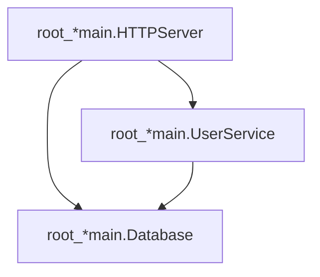

<div align="center">

# do-auditlog

**See every dependency, every event.**

Audit-log plugin for [samber/do v2](https://github.com/samber/do) — track every registration, invocation, and shutdown with timestamps, dependency graphs, and self-contained HTML visualization.

[](https://github.com/LarsArtmann/samber-do-auditlog/actions/workflows/ci.yml)
[](https://pkg.go.dev/github.com/larsartmann/samber-do-auditlog)
[](https://opensource.org/licenses/MIT)

[Documentation](https://do-auditlog.lars.software) &middot; [Quick Start](https://do-auditlog.lars.software/getting-started/quick-start/) &middot; [API Reference](https://do-auditlog.lars.software/api-reference/)

</div>

> [!CAUTION]
> **Alpha.** The API may change between releases. Pin to a specific commit if you use this in production. Feedback welcome in [Issues](https://github.com/larsartmann/samber-do-auditlog/issues).

---

## What does it look like?

A single self-contained HTML file. No server, no dependencies, no external requests.


<details>
<summary><b>More screenshots</b></summary>

<table>
<tr>
<td align="center"><b>Dependency Graph</b></td>
<td align="center"><b>Timeline</b></td>
</tr>
<tr>
<td></td>
<td></td>
</tr>
<tr>
<td align="center"><b>Events Stream</b></td>
<td align="center"><b>Real-World Usage</b></td>
</tr>
<tr>
<td></td>
<td></td>
</tr>
</table>

</details>

---

## Why?

samber/do v2 gives you lifecycle hooks but nothing to consume them. No recorder, no export, no visualization. You're flying blind.

**do-auditlog** wires into those hooks in one line and gives you:

- What services exist, when they were created, and how long they took to build
- Which services depend on which — forward and reverse
- The full scope tree with per-scope service lists
- A complete chronological event stream
- A self-contained HTML page you can open in any browser to explore your DI container

## Install

```bash
go get github.com/larsartmann/samber-do-auditlog
```

Requires Go 1.26+ and [samber/do v2](https://github.com/samber/do).

> **Try the demo:** `git clone` this repo and run `DO_AUDITLOG_ENABLED=true go run ./example` — 20 services across 4 scopes with health checks, shutdowns, and invocation errors.

## Quick Start

```go
package main

import (
    "os"

    auditlog "github.com/larsartmann/samber-do-auditlog"
    "github.com/samber/do/v2"
)

func main() {
    // 1. Create the plugin and pass hooks to the DI container
    plugin, err := auditlog.New(auditlog.Config{
        Enabled:     true,
        ContainerID: "my-app",
    })
    if err != nil {
        panic(err)
    }

    injector := do.NewWithOpts(plugin.Opts())

    // 2. Register and invoke services as usual
    do.Provide(injector, func(i do.Injector) (*Database, error) {
        return &Database{}, nil
    })
    do.MustInvoke[*Database](injector)

    // 3. Export — open in any browser
    plugin.ExportToHTML("audit.html")

    // Other formats:
    plugin.ExportToFile("audit.json")             // full JSON snapshot
    plugin.ExportEventsToNDJSON("events.ndjson")  // streaming format
    plugin.Report().WriteMermaid(os.Stdout)       // paste into GitHub README
}
```

## Features

| Feature                  | What it gives you                                                                      |
| ------------------------ | -------------------------------------------------------------------------------------- |
| **Drop-in setup**        | `do.NewWithOpts(plugin.Opts())` — one line, zero config                               |
| **Dependency graph**     | Infers which service resolved which, without touching do's internal DAG                |
| **Reverse dependencies** | Every service knows who depends on it                                                  |
| **Scope tree**           | Full hierarchy with per-scope service lists and cross-scope resolution                 |
| **Service types**        | Auto-detects lazy / eager / transient / alias via `do.ExplainNamedService`             |
| **Timing**               | First build duration, shutdown duration, invocation count and order                    |
| **Health checks**        | Wraps `injector.HealthCheck()` with per-service audit events                           |
| **16+ export formats**   | JSON, NDJSON, CSV, TSV, HTML, Mermaid, PlantUML, DOT, D2, tree, table                  |
| **Filtered reports**     | Slice by name, type, scope, event type, or time range before exporting                 |
| **Real-time streaming**  | `OnEvent` callback fires on every event — stream to Prometheus, OTel, or dashboards    |
| **~1.7 us overhead**     | In-memory capture during operation. Toggle off for zero cost                           |
| **Minimal deps**         | `samber/do/v2` + `a-h/templ` + `larsartmann/go-output` (diagrams and tables)           |

## Export Formats

Every format is a single method call. All write to `io.Writer`; most have a matching `ExportTo*` file helper.

| Format                  | Method                              | Best for                                   |
| ----------------------- | ----------------------------------- | ------------------------------------------ |
| **HTML**                | `ExportToHTML(path)`                | Interactive 5-tab visualization, sharing   |
| **JSON**                | `ExportToFile(path)`                | Full snapshot, programmatic analysis       |
| **NDJSON**              | `ExportEventsToNDJSON(path)`        | Streaming, log aggregators, replay         |
| **CSV / TSV**           | `ExportToCSV(path)` / `ExportToTSV`  | Spreadsheets, data pipelines               |
| **Mermaid**             | `report.WriteMermaid(w)`            | Inline in GitHub, GitLab, Notion           |
| **PlantUML**            | `report.WritePlantUML(w)`           | IntelliJ, online editors                   |
| **DOT**                 | `report.WriteDOT(w)`                | Graphviz rendering                         |
| **D2**                  | `report.WriteD2(w)`                 | Modern diagram rendering                   |
| **ASCII Tree**          | `report.WriteTree(w)`               | Quick dependency overview in terminal      |
| **HTML Tree**           | `report.WriteHTMLTree(w)`           | Nested-list dependency tree                |
| **Table (16+ formats)** | `report.WriteTable(w, format, ...)` | Markdown, YAML, TOML, XML, and more        |

The Mermaid output renders natively on GitHub:



## Real-Time Event Streaming

Pass an `OnEvent` callback to react to events as they happen — no polling, no background goroutines:

```go
plugin, err := auditlog.New(auditlog.Config{
    Enabled: true,
    OnEvent: func(ev auditlog.Event) {
        // Stream to Prometheus, OpenTelemetry, a live dashboard...
        log.Printf("event %d: %s %s", ev.Sequence, ev.EventType, ev.ServiceName)
    },
})
```

The callback fires **outside the mutex** on every event. Keep it fast.

## CLI Tool

Inspect, convert, diff, and validate reports from the command line:

```bash
go install ./cmd/auditlog

auditlog info report.json         # summary stats
auditlog convert report.json -f ndjson   # JSON to NDJSON
auditlog diff old.json new.json   # structural comparison
auditlog validate report.json     # schema validation
```

## Performance

| Path          | Overhead    | Allocs |
| ------------- | ----------- | ------ |
| Enabled       | ~1.7 us     | 6      |
| Disabled      | ~113 ns     | 4      |

In-memory capture — no file I/O during container operation. You pay the cost only when you export. Full benchmarks in [BENCHMARKS.md](BENCHMARKS.md).

## Documentation

| Guide | What you'll learn |
| ----- | ----------------- |
| [Quick Start](https://do-auditlog.lars.software/getting-started/quick-start/) | From zero to HTML report in 60 seconds |
| [Installation](https://do-auditlog.lars.software/getting-started/installation/) | Prerequisites and setup |
| [Dependency Tracking](https://do-auditlog.lars.software/guides/dependency-tracking/) | How the invocation stack infers the graph |
| [Export Formats](https://do-auditlog.lars.software/guides/export-formats/) | Every format with examples |
| [Filtered Reports](https://do-auditlog.lars.software/guides/filtered-reports/) | Slice by name, type, scope, time |
| [Health Checks](https://do-auditlog.lars.software/guides/health-checks/) | Per-service health audit events |
| [Performance](https://do-auditlog.lars.software/guides/performance/) | Benchmarks and tuning |
| [API Reference](https://do-auditlog.lars.software/api-reference/) | Full type and method documentation |
| [pkg.go.dev](https://pkg.go.dev/github.com/larsartmann/samber-do-auditlog) | Godoc |

## Contributing

See [CONTRIBUTING.md](CONTRIBUTING.md). The project uses strict golangci-lint (109 linters), 94% test coverage gate, and fuzz testing (5 targets).

## License

[MIT](https://opensource.org/licenses/MIT)
