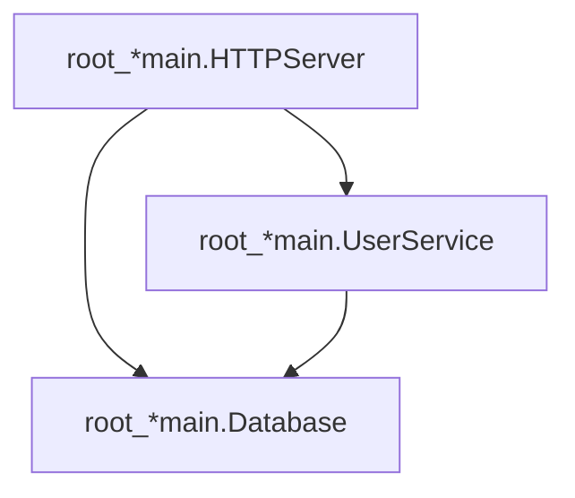
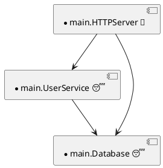

<div align="center">

# 🔍 do-auditlog

**Audit-log plugin for [samber/do v2](https://github.com/samber/do)**

Track every service registration, invocation, and shutdown.
Get timestamps, build durations, dependency graphs, and scope trees.
Export as JSON, NDJSON, or a self-contained HTML visualization.

[](https://github.com/LarsArtmann/samber-do-auditlog/actions/workflows/ci.yml)
[](https://pkg.go.dev/github.com/larsartmann/samber-do-auditlog)
[](https://goreportcard.com/report/github.com/larsartmann/samber-do-auditlog)
[](https://opensource.org/licenses/MIT)

</div>

---

> [!CAUTION]
>
> ## 🚧 ALPHA — WORK IN PROGRESS 🚧
>
> This project is in **early development**. The API may change at any time without notice.
>
> **No guarantees** are made regarding:
>
> - Backward compatibility between versions
> - Stability of exported types and functions
> - Correctness in all edge cases
>
> **Use at your own risk.** Pin your dependency to a specific commit hash if you depend on this in production.
>
> Feedback, bug reports, and breaking-change requests are very welcome in [Issues](https://github.com/larsartmann/samber-do-auditlog/issues).

---

## Why?

samber/do v2 has lifecycle hooks but no built-in observability. You get hooks, but no recorder, no export, no visualization.

**do-auditlog** wires into those hooks in one line and gives you:

- What services exist, when they were created, and how long they took to build
- Which services depend on which — forward and reverse
- The scope tree with per-scope service lists
- A complete chronological event stream
- A self-contained HTML page you can open in any browser to explore your DI container

## Features

| Feature                  | Description                                                              |
| ------------------------ | ------------------------------------------------------------------------ |
| **Drop-in setup**        | `do.NewWithOpts(plugin.Opts())` — one line, zero config                  |
| **Dependency graph**     | Infers which service resolved which, without accessing do's internal DAG |
| **Reverse dependencies** | Every service knows who depends on it                                    |
| **Scope tree**           | Full hierarchy with per-scope service lists                              |
| **Service types**        | Auto-detects lazy/eager/transient/alias via `do.ExplainNamedService`     |
| **Timing**               | First build duration, shutdown duration, invocation count & order        |
| **Health checks**        | Wraps `injector.HealthCheck()` with per-service audit events             |
| **9 export formats**     | JSON · NDJSON · CSV · TSV · HTML · Mermaid · PlantUML · DOT · D2         |
| **Filtered reports**     | Functional options to slice by name, type, scope, event type, time range |
| **~1.7μs overhead**      | In-memory capture, no I/O during container operation                     |
| **Toggle on/off**        | `Enabled: false` → zero hooks, zero cost                                 |
| **Minimal deps**         | Only `samber/do/v2` + `a-h/templ` (HTML visualization)                   |

## Install

```bash
go get github.com/larsartmann/samber-do-auditlog
```

Requires Go 1.26+ and samber/do v2.

## Quick Start

```go
package main

import (
    "os"

    "github.com/larsartmann/samber-do-auditlog"
    "github.com/samber/do/v2"
)

func main() {
    // 1. Create the plugin (validates config, returns error on invalid input)
    plugin, err := auditlog.New(auditlog.Config{
        Enabled:     true,           // flip to false in production
        ContainerID: "my-app",
    })
    if err != nil {
        panic(err)
    }

    // 2. Pass options to the DI container
    injector := do.NewWithOpts(plugin.Opts())

    // 3. Register and use services as usual
    do.Provide(injector, func(i do.Injector) (*MyService, error) {
        return &MyService{}, nil
    })
    svc := do.MustInvoke[*MyService](injector)
    _ = svc

    // 4. Export when you're done
    plugin.ExportToFile("audit.json")              // full report
    plugin.ExportEventsToNDJSON("events.ndjson")   // streaming format
    plugin.ExportToHTML("audit.html")              // open in browser

    // 5. Filtered export — only lazy services in a specific scope
    plugin.ExportFilteredToFile("lazy.json",
        auditlog.WithServicesByType(auditlog.ProviderTypeLazy),
        auditlog.WithScope("drivers"),
    )

    // 6. Mermaid dependency graph
    report := plugin.Report()
    report.WriteMermaid(os.Stdout)                 // paste into GitHub README
}
```

## Export Formats

### JSON Report

Full snapshot: event timeline, service summaries, scope tree.

```json
{
  "version": "0.2.0",
  "container_id": "my-app",
  "exported_at": "2026-06-09T22:18:00Z",
  "service_count": 3,
  "event_count": 20,
  "services": [
    {
      "service_name": "*main.UserService",
      "invocation_count": 1,
      "invocation_order": 2,
      "first_build_duration_ms": 9.079,
      "dependencies": [
        { "scope_id": "...", "scope_name": "[root]", "service_name": "*main.Database" },
        { "scope_id": "...", "scope_name": "[root]", "service_name": "*main.Cache" }
      ],
      "dependents": [
        { "scope_id": "...", "scope_name": "[root]", "service_name": "*main.HTTPServer" }
      ]
    }
  ],
  "scope_tree": {
    "name": "[root]",
    "services": ["*main.Config", "*main.Database", "*main.Cache"],
    "children": []
  }
}
```

### NDJSON Event Stream

One JSON object per line. Feed it into log aggregators, stream processors, or custom tooling.

```ndjson
{"sequence":1,"timestamp":"...","event_type":"registration","phase":"before","container_id":"my-app","scope_id":"...","scope_name":"[root]","service_name":"*main.Config"}
{"sequence":2,"timestamp":"...","event_type":"registration","phase":"after","container_id":"my-app","scope_id":"...","scope_name":"[root]","service_name":"*main.Config"}
{"sequence":3,"timestamp":"...","event_type":"invocation","phase":"before","container_id":"my-app","scope_id":"...","scope_name":"[root]","service_name":"*main.Database"}
{"sequence":4,"timestamp":"...","event_type":"invocation","phase":"after","container_id":"my-app","scope_id":"...","scope_name":"[root]","duration_ms":5.196,"service_name":"*main.Database"}
```

### HTML Visualization

A single, self-contained dark-themed HTML page. No external JS/CSS. Works offline.

**What you get:**

- **Stats cards** — services, events, scopes, dependency count, health check status
- **Services table** — name, type badge, scope, invocation order, count, build time, deps, status, health
- **Scopes tab** — collapsible scope tree with type emoji chips
- **Dependency graph** — Sugiyama layered DAG layout with type-colored nodes, pan/zoom, click-to-highlight
- **Timeline** — dual build+shutdown horizontal bars with type icons
- **Events table** — full chronological log with type filter chips and keyboard navigation

Open the file in any browser. No server needed.

### Mermaid Flowchart

Writes a `flowchart TD` representing the dependency graph. Paste it into any Markdown file that renders Mermaid (GitHub, GitLab, Notion).

```go
report := plugin.Report()
report.WriteMermaid(os.Stdout)
```



### PlantUML Component Diagram

Writes a PlantUML component diagram. Paste it into any PlantUML renderer (GitHub with plugin, GitLab, IntelliJ, online editors).

```go
report := plugin.Report()
report.WritePlantUML(os.Stdout)
```



### Filtered Reports

Functional options let you slice the report before exporting. Filters compose — pass multiple options to intersect them.

```go
// Only invocation events in the last 5 minutes
report := plugin.ReportFiltered(
    auditlog.WithEventsByType(auditlog.EventTypeInvocation),
    auditlog.WithTimeRange(time.Now().Add(-5*time.Minute), time.Now()),
)

// Only eager services
report = plugin.ReportFiltered(
    auditlog.WithServicesByType(auditlog.ProviderTypeEager),
)

// Only services named "*main.Database" in scope "drivers"
report = plugin.ReportFiltered(
    auditlog.WithServicesByName("*main.Database"),
    auditlog.WithScope("drivers"),
)

// Export the filtered report
plugin.ExportFilteredToFile("filtered.json",
    auditlog.WithServicesByType(auditlog.ProviderTypeLazy),
)
```

**Available filters:**

| Option                         | Filters by                                                    |
| ------------------------------ | ------------------------------------------------------------- |
| `WithServicesByName(names...)` | Service name(s)                                               |
| `WithServicesByType(type)`     | Provider type (lazy, eager, transient, alias)                 |
| `WithEventsByType(type)`       | Event type (registration, invocation, shutdown, health_check) |
| `WithTimeRange(from, to)`      | Event timestamp range                                         |
| `WithScope(scopeID)`           | Scope ID                                                      |

## Health Checks

samber/do v2 does not expose health-check hooks. do-auditlog wraps `injector.HealthCheckWithContext()` to record `EventTypeHealthCheck` events per service.

```go
err := plugin.RecordHealthCheckWithContext(ctx, injector)
report := plugin.Report()
if !report.HealthCheckSucceeded {
    for _, svc := range report.UnhealthyServices() {
        log.Printf("unhealthy: %s — %s", svc.ServiceName, *svc.HealthCheckError)
    }
}
```

Health check events are `PhaseAfter` only (there is no before-hook). Per-service timing is unavailable from the bulk API, so `DurationMs` is `nil` for health check events.

## Real-Time Event Streaming

Provide an `OnEvent` callback to react to events as they happen — no polling required.

```go
plugin, err := auditlog.New(auditlog.Config{
    Enabled: true,
    OnEvent: func(ev auditlog.Event) {
        // Stream to Prometheus, OTel, a live dashboard, or custom tooling
        log.Printf("event %d: %s %s", ev.Sequence, ev.EventType, ev.ServiceName)
    },
})
if err != nil {
    log.Fatalf("create auditlog plugin: %v", err)
}
```

The callback is called **outside the mutex** on every event. Keep it fast — do not block the hot path.

## API Reference

### Plugin

| Method                                        | Description                                                |
| --------------------------------------------- | ---------------------------------------------------------- |
| `New(config Config) (*Plugin, error)`         | Create plugin. Validates config, returns error if invalid. |
| `Opts() *do.InjectorOpts`                     | Hooks for `do.NewWithOpts`. No-ops when `Enabled: false`.  |
| `Report() Report`                             | In-memory snapshot. No I/O.                                |
| `ReportFiltered(opts...) Report`              | Filtered snapshot with functional options.                 |
| `Events() []Event`                            | Defensive copy of raw event slice.                         |
| `EventsCount() int`                           | Event count without copying.                               |
| `RecordHealthCheck(injector)`                 | Wrap `injector.HealthCheck()` with audit events.           |
| `RecordHealthCheckWithContext(ctx, injector)` | Same with context.                                         |
| `WriteReportJSON(w) error`                    | Indented JSON to any `io.Writer`.                          |
| `WriteEventsNDJSON(w) error`                  | NDJSON event stream to any `io.Writer`.                    |
| `WriteHTML(w) error`                          | Self-contained HTML visualization to any `io.Writer`.      |
| `ExportToFile(path) error`                    | JSON report to file.                                       |
| `ExportEventsToNDJSON(path) error`            | NDJSON events to file.                                     |
| `ExportToHTML(path) error`                    | HTML visualization to file.                                |
| `ExportFilteredToFile(path, opts...) error`   | Filtered JSON report to file.                              |

**Package-level**

| Function                                     | Description                                                                                                                          |
| -------------------------------------------- | ------------------------------------------------------------------------------------------------------------------------------------ |
| `MigrateReport(data []byte) (Report, error)` | Normalize/repair a JSON report to the current schema (upgrades v0.1.0 and re-derives all denormalized fields for any input version). |

### Report

| Method                                     | Description                                         |
| ------------------------------------------ | --------------------------------------------------- |
| `Filtered(opts...) Report`                 | New report with filters applied, counts recomputed. |
| `Validate() error`                         | Check denormalized counts match actual data.        |
| `Index() ReportIndex`                      | Build O(1) lookup index for multiple queries.       |
| `ServiceByName(name) *ServiceInfo`         | Lookup by service name.                             |
| `ServiceByRef(scopeID, name) *ServiceInfo` | Lookup by scope + name.                             |
| `ServicesByScope(scopeID) []ServiceInfo`   | All services in a scope.                            |
| `EventsByService(name) []Event`            | All events for a service.                           |
| `EventsByRef(scopeID, name) []Event`       | All events for a scoped service.                    |
| `EventsByType(type) []Event`               | All events of a given type.                         |
| `FailedServices() []ServiceInfo`           | Services with invocation or shutdown errors.        |
| `UnhealthyServices() []ServiceInfo`        | Services with health check errors.                  |
| `WriteJSON(w) error`                       | Indented JSON report to `io.Writer`.                |
| `WriteNDJSON(w) error`                     | NDJSON event stream to `io.Writer`.                 |
| `WriteHTML(w) error`                       | Self-contained HTML visualization to `io.Writer`.   |
| `WriteCSV(w) error`                        | Comma-separated values (all services).              |
| `WriteTSV(w) error`                        | Tab-separated values (all services).                |
| `WriteMermaid(w) error`                    | Mermaid flowchart to `io.Writer`.                   |
| `WritePlantUML(w) error`                   | PlantUML component diagram to `io.Writer`.          |
| `WriteDOT(w) error`                        | Graphviz DOT digraph to `io.Writer`.                |
| `WriteD2(w) error`                         | D2 diagram to `io.Writer`.                          |
| `Diff(other Report) DiffResult`            | Structural comparison between two reports.          |

### Package Functions

| Function                                            | Purpose                                      |
| --------------------------------------------------- | -------------------------------------------- |
| `New(...) (*Plugin, error)`                         | Construct a plugin from Config (validated).  |
| `NewReport(...) (Report, error)`                    | Construct a validated Report from core data. |
| `LoadReport(path, opts...) (Report, Format, error)` | Auto-detect JSON/NDJSON and load.            |
| `ReadEvents(reader) ([]Event, error)`               | Read NDJSON event stream.                    |
| `ReplayEvents(events) (Report, error)`              | Reconstruct a Report from events.            |
| `MigrateReport(data) (Report, error)`               | Migrate/repair old or stale JSON.            |
| `JSONSchema() string`                               | Canonical JSON Schema for the report format. |

## How Dependency Tracking Works

do-auditlog does **not** access samber/do's internal DAG. Instead, it uses a lightweight invocation stack:

1. `HookBeforeInvocation` fires for service A → A is pushed onto a stack
2. A's provider calls `do.MustInvoke[B](i)` → `HookBeforeInvocation` fires for B while A is still on the stack
3. The plugin records: **A depends on B**
4. `HookAfterInvocation` fires → service is popped from the stack

This correctly reconstructs the dependency graph even for:

- **Cached services** — subsequent invocations of a lazy service are near-instant but still tracked
- **Cross-scope resolution** — services inherited from parent scopes
- **Provider errors** — failed invocations are still recorded with error details

The reverse graph (`Dependents`) is computed at report time from the forward dependencies.

## Performance

Benchmarks from a real run (AMD Ryzen AI MAX+ 395):

```
BenchmarkHookOverhead_Invocation    ~1,658 ns/op    6 allocs    (enabled)
BenchmarkHookOverhead_Disabled       ~113 ns/op    4 allocs    (disabled)
BenchmarkHookOverhead_Registration  ~21,982 ns/op   54 allocs    (full container)
```

**Overhead: ~1.7μs per cached invocation** when enabled. Zero cost when disabled.

No file I/O happens during container operation. Export is a single `json.Marshal` or line iteration — you pay the cost only when you need the data.

## Data Model

```
Report
├── version                    string (schema version, e.g. "0.2.0")
├── container_id               string
├── exported_at                time
├── service_count              int
├── event_count                int
├── scope_count                int
├── total_build_duration_ms    float64
├── total_shutdown_duration_ms float64
├── shutdown_succeeded         bool
├── health_check_succeeded     bool
├── health_checked_count       int
├── services[]                 ServiceInfo
│   ├── service_name           string
│   ├── scope_id               string
│   ├── scope_name             string
│   ├── service_type           string (lazy, eager, transient, alias)
│   ├── status                 string (registered, active, invocation_error, shutdown, shutdown_error)
│   ├── registered_at          time
│   ├── invocation_count       int
│   ├── invocation_order       int
│   ├── first_build_duration_ms float64
│   ├── shutdown_duration_ms   float64
│   ├── invocation_error       string (on failure)
│   ├── shutdown_error         string (on failure)
│   ├── dependencies[]         {scope_id, scope_name, service_name}
│   ├── dependents[]           {scope_id, scope_name, service_name}
│   ├── health_check_count     int
│   ├── health_check_error     string (on failure)
│   ├── is_healthchecker       bool
│   └── is_shutdowner          bool
├── events[]                   Event
│   ├── sequence               int (monotonic)
│   ├── timestamp              time
│   ├── container_id           string
│   ├── scope_id               string
│   ├── scope_name             string
│   ├── service_name           string
│   ├── service_type           string
│   ├── event_type             registration | invocation | shutdown | health_check
│   ├── phase                  before | after
│   ├── duration_ms            float64 (after-invocation/shutdown only)
│   └── error                  string (on failure only)
└── scope_tree                 ScopeNode
    ├── id                     string
    ├── name                   string
    ├── services[]             string
    └── children[]             ScopeNode (recursive)
```

> **Schema migration**: Reports exported with v0.1.0 can be upgraded to the current schema with `auditlog.MigrateReport(oldJSONBytes)`. `MigrateReport` also repairs current-schema reports — it re-derives every denormalized field, so stale or hand-edited reports that would fail `Validate()` are normalized to a valid report.

## Security

This project enforces security through:

- **gosec** — security scanner integrated into golangci-lint (108 linters, 0 issues)
- **CSP** — HTML output includes a strict Content-Security-Policy meta tag
- **XSS hardening** — all user-controlled strings escaped via templ's context-aware auto-escaping
- **Fuzz testing** — 3 fuzz targets verify XSS resilience against malicious service names, error messages, and dependency chains

Recommended additional check:

```bash
govulncheck ./...  # requires: go install golang.org/x/vuln/cmd/govulncheck@latest
```

## License

[MIT](https://opensource.org/licenses/MIT)
