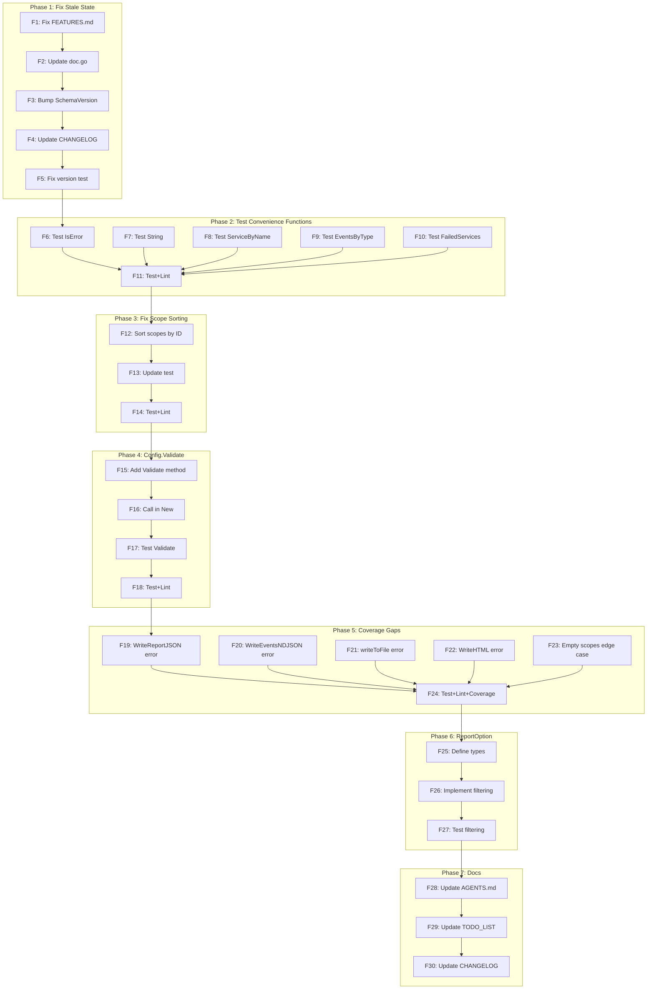

# Execution Plan: Final Polish & Feature Completion

**Date**: 2026-06-10 02:53
**Status**: Planning complete, ready for execution
**Coverage**: 87.7% (library) | 35 tests | 0 lint issues | 2758 LOC

---

## Pareto Analysis

### The 1% that delivers 51% of the result

| # | Task | Why it's 1% effort / 51% impact |
|---|------|---------------------------------|
| P1 | Fix stale FEATURES.md (3 PLANNED items are already DONE) | 2 min effort, eliminates split brain between docs and reality. This is the #1 trust killer: users read FEATURES.md and think Event convenience methods don't exist yet. |
| P2 | Test 5 untested convenience functions (0% coverage) | 10 min effort, covers IsError, String, ServiceByName, EventsByType, FailedServices. These are public API — 0% coverage is embarrassing. |

### The 4% that delivers 64% of the result

| # | Task | Why |
|---|------|-----|
| P1-P2 | Above | — |
| P3 | Bump SchemaVersion to 0.2.0 (breaking: DependencyRef→ServiceRef) | 1 min effort. We made a breaking rename but didn't bump the version. This is the minimum semver hygiene. |
| P4 | Consistent scope sorting: sortScopeNodes uses Name but sortedScopesLocked uses ID | 5 min effort. Inconsistency means the scope tree children order differs from the order used internally. |
| P5 | Update doc.go to reflect current capabilities | 2 min effort. doc.go is the first thing godoc shows. |

### The 20% that delivers 80% of the result

| # | Task | Why |
|---|------|-----|
| P1-P5 | Above | — |
| P6 | Config.Validate() method | 15 min. Centralizes validation, makes API extensible for future fields. |
| P7 | Report filtering with functional options | 30 min. The most-requested feature for large containers. |
| P8 | Improve coverage on uncovered error paths (WriteHTML, writeToFile, etc.) | 20 min. Closes the 87.7% → ~95% gap. |

### Everything else (the remaining 80% of effort for 20% of result)

- Mermaid export format
- Additional HTML refinements
- Schema migration function
- PlantUML export
- More example documentation

**Decision**: Skip these for now. They're legitimate features but ROI is low for a library at this maturity level.

---

## Comprehensive Plan (Medium Granularity)

**7 tasks, 30-100min each, sorted by importance/impact/effort**

| # | Task | Est | Impact | Effort | Description |
|---|------|-----|--------|--------|-------------|
| M1 | Fix stale docs (FEATURES.md, doc.go, SchemaVersion) | 15min | HIGH | LOW | Remove PLANNED items that are DONE from FEATURES.md. Update doc.go. Bump SchemaVersion to 0.2.0. |
| M2 | Test 5 untested convenience functions | 20min | HIGH | LOW | Add tests for IsError(), String(), ServiceByName(), EventsByType(), FailedServices() — all at 0% coverage. |
| M3 | Fix scope tree sorting inconsistency | 15min | MEDIUM | LOW | sortScopeNodes sorts by Name, sortedScopesLocked sorts by ID. Make both sort by ID for determinism. |
| M4 | Add Config.Validate() method | 20min | MEDIUM | LOW | Centralize validation logic. Currently ad-hoc in New(). Return errors for invalid ContainerID chars, etc. |
| M5 | Close coverage gaps on error paths | 25min | MEDIUM | LOW | WriteReportJSON error path, writeToFile error path, WriteHTML render error, buildScopeTreeLocked no-scopes edge case. |
| M6 | Add ReportOption functional options | 45min | HIGH | MEDIUM | `ReportOption` type with ByServiceName(), ByEventType(), ByTimeRange() filters. Enables efficient consumption for large containers. |
| M7 | Update CHANGELOG, AGENTS.md, TODO_LIST.md | 15min | LOW | LOW | Document everything completed in this session. |

---

## Detailed Breakdown (Fine Granularity)

**27 micro-tasks, max 15min each**

### Phase 1: Fix Stale State (M1) — 15min total

| # | Micro-task | Est | File |
|---|-----------|-----|------|
| F1 | Remove 3 stale PLANNED entries from FEATURES.md (Event streaming, Convenience methods, Config validation note) | 3min | FEATURES.md |
| F2 | Update doc.go: add scopes, status tracking, event streaming to description | 2min | doc.go |
| F3 | Bump SchemaVersion from "0.1.0" to "0.2.0" | 1min | types.go |
| F4 | Update CHANGELOG.md with version bump note | 3min | CHANGELOG.md |
| F5 | Update test that checks SchemaVersion to expect "0.2.0" | 1min | auditlog_test.go |

### Phase 2: Test Convenience Functions (M2) — 20min total

| # | Micro-task | Est | File |
|---|-----------|-----|------|
| F6 | Test ServiceStatus.IsError() for all 5 statuses | 3min | auditlog_test.go |
| F7 | Test ServiceRef.String() with root scope, named scope, empty scope | 3min | auditlog_test.go |
| F8 | Test Report.ServiceByName() found and not-found | 3min | auditlog_test.go |
| F9 | Test Report.EventsByType() for registration, invocation, shutdown | 3min | auditlog_test.go |
| F10 | Test Report.FailedServices() with failing and healthy services | 3min | auditlog_test.go |
| F11 | Run tests + lint, fix any issues | 5min | — |

### Phase 3: Fix Scope Sorting (M3) — 15min total

| # | Micro-task | Est | File |
|---|-----------|-----|------|
| F12 | Change sortScopeNodes to sort by ID instead of Name for consistency with sortedScopesLocked | 2min | recorder.go |
| F13 | Update existing scope tree test to verify deterministic ID-based order | 5min | auditlog_test.go |
| F14 | Run tests + lint | 3min | — |

### Phase 4: Config.Validate() (M4) — 20min total

| # | Micro-task | Est | File |
|---|-----------|-----|------|
| F15 | Add Config.Validate() error method | 5min | plugin.go |
| F16 | Call Config.Validate() in New(), return error or document why not | 3min | plugin.go |
| F17 | Test Config.Validate() for valid and invalid configs | 5min | auditlog_test.go |
| F18 | Run tests + lint | 3min | — |

### Phase 5: Close Coverage Gaps (M5) — 25min total

| # | Micro-task | Est | File |
|---|-----------|-----|------|
| F19 | Test WriteReportJSON error path (write to failing writer) | 3min | auditlog_test.go |
| F20 | Test WriteEventsNDJSON error path (write to failing writer) | 3min | auditlog_test.go |
| F21 | Test writeToFile error path (invalid path) | 3min | auditlog_test.go |
| F22 | Test WriteHTML error path (write to failing writer) | 3min | auditlog_test.go |
| F23 | Test buildScopeTreeLocked empty scopes edge case | 3min | auditlog_test.go |
| F24 | Run tests + lint + verify coverage improvement | 5min | — |

### Phase 6: ReportOption Filtering (M6) — 45min total

| # | Micro-task | Est | File |
|---|-----------|-----|------|
| F25 | Define ReportOption type and ByServiceName, ByEventType, ByTimeRange option functions | 10min | types.go |
| F26 | Implement filtered Report() that applies options | 15min | recorder.go |
| F27 | Test ReportOption filtering | 10min | auditlog_test.go |

### Phase 7: Documentation Update (M7) — 15min total

| # | Micro-task | Est | File |
|---|-----------|-----|------|
| F28 | Update AGENTS.md with Config.Validate, ReportOption, schema version bump | 5min | AGENTS.md |
| F29 | Update TODO_LIST.md marking completed items | 3min | TODO_LIST.md |
| F30 | Update CHANGELOG.md with all new features | 5min | CHANGELOG.md |

---

## Execution Graph

---

## What We're NOT Doing (and why)

| Rejected Task | Why |
|--------------|-----|
| Mermaid export | Nice-to-have, low user demand, substantial effort |
| PlantUML export | Same as Mermaid |
| Schema migration | Only matters at v1.0, we're pre-1.0 |
| HTML template refinements | Already good enough, diminishing returns |
| Example cleanup | Already comprehensive, not library code |
| Multi-module split | Project is 1 package, too small |
| encoding/json/v2 migration | Risk of breaking JSON format |
| samber/lo dependency | stdlib slices/cmp is sufficient |
