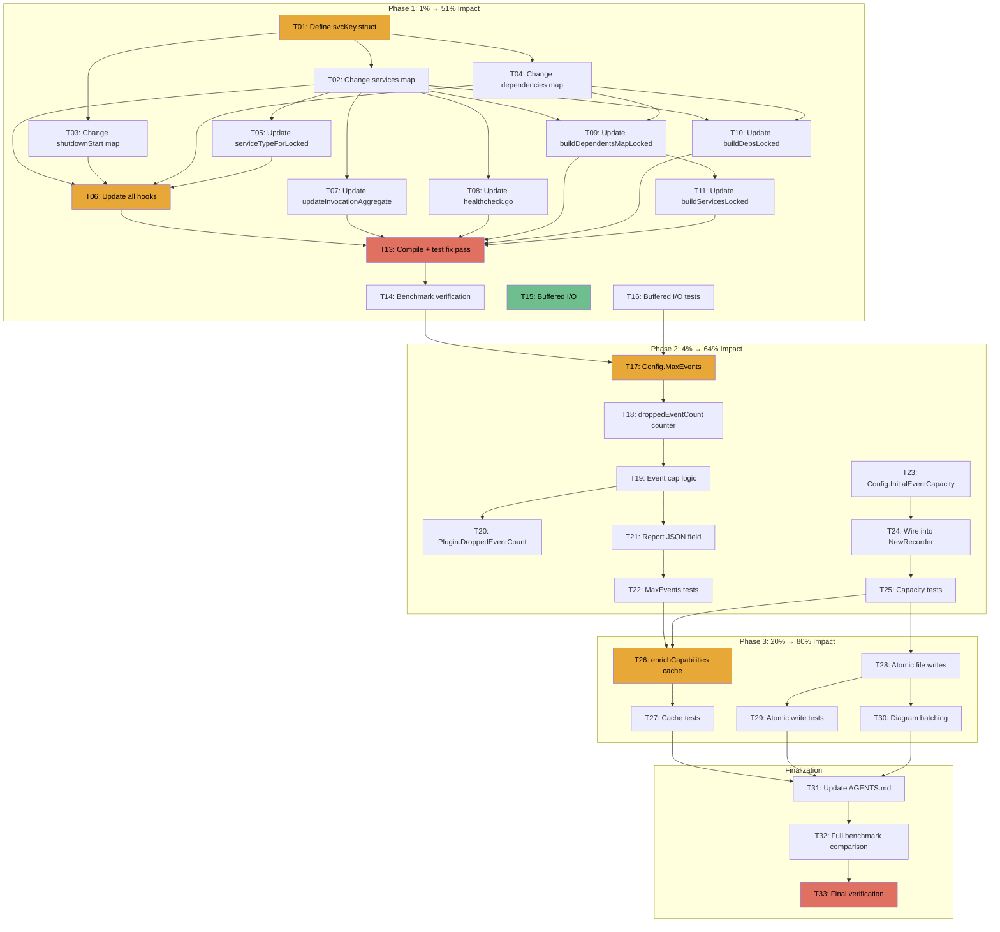

# Performance Optimization Execution Plan

**Date:** 2025-06-14  
**Based on:** [Performance Review](../research/performance-review.html)  
**Goal:** Reduce GC pressure (43%→<15% CPU), eliminate OOM risk, reduce I/O syscalls, without breaking the public API or build.

---

## Pareto Breakdown

### The 1% that delivers 51% of the result

| #   | Task                                                                                                                    | Impact                                                                                                                    | Why                                                                                                                              |
| --- | ----------------------------------------------------------------------------------------------------------------------- | ------------------------------------------------------------------------------------------------------------------------- | -------------------------------------------------------------------------------------------------------------------------------- |
| 1   | **Struct map key** — replace `serviceKey()` string concat with `svcKey{scopeID, name}` struct key for all internal maps | Eliminates 3 of 9 allocations per hook invocation (33% reduction). GC is 43% of CPU → this alone could halve GC overhead. | `serviceKey()` is called 2–3× per hook, each producing a heap-allocated string. A struct key is a stack value — zero allocation. |
| 2   | **Buffered I/O** — wrap `os.File` in `bufio.Writer` inside `writeToFile()`                                              | NDJSON export drops from N syscalls to ~1. 10–100× fewer context switches.                                                | Single-line change. Currently every `fmt.Fprintln` / `json.Encode` hits the kernel.                                              |

### The 4% that delivers 64% of the result

| #   | Task                                                                    | Impact                                                           | Why                                                                                             |
| --- | ----------------------------------------------------------------------- | ---------------------------------------------------------------- | ----------------------------------------------------------------------------------------------- |
| 3   | **Config.MaxEvents** — cap the events slice to prevent unbounded growth | Eliminates OOM risk in long-running processes.                   | The `events` slice grows forever. At 10K invocations/sec it reaches 4GB in ~55 minutes.         |
| 4   | **Config.InitialEventCapacity** — let users pre-size the events slice   | Eliminates `runtime.growslice` (31% of CPU) for known workloads. | Currently hardcoded to 1024. A user with 5000 services can pre-size and avoid 4+ reallocations. |

### The 20% that delivers 80% of the result

| #   | Task                                                                                          | Impact                                             | Why                                                                                                     |
| --- | --------------------------------------------------------------------------------------------- | -------------------------------------------------- | ------------------------------------------------------------------------------------------------------- |
| 5   | **enrichCapabilities cache** — cache `do.ExplainInjector` results, invalidate on registration | Reduces BuildReport CPU by ~33% on repeat calls.   | `do.ExplainInjector` is 33.4% of BuildReport CPU and 42.9% of its allocations. Called every `Report()`. |
| 6   | **Atomic file writes** — write to temp file + `os.Rename`                                     | Crash-safe exports. No partial files.              | Currently `os.Create` truncates immediately. A crash mid-write corrupts the file.                       |
| 7   | **Diagram export batching** — use `strings.Builder` + single write                            | Reduces syscall count for Mermaid/PlantUML export. | Currently 1 `fmt.Fprintln` per diagram line.                                                            |

---

## Comprehensive Task List (30–100 min each)

Sorted by impact/effort/customer-value.

| ID  | Task                                                               | Files                          | Impact   | Effort | Dependencies    |
| --- | ------------------------------------------------------------------ | ------------------------------ | -------- | ------ | --------------- |
| T01 | Define `svcKey` struct type in recorder.go                         | recorder.go                    | Critical | 10min  | —               |
| T02 | Change `services` map to `map[svcKey]*serviceRecord`               | recorder.go                    | Critical | 15min  | T01             |
| T03 | Change `shutdownStart` map to `map[svcKey]time.Time`               | recorder.go                    | Critical | 10min  | T01             |
| T04 | Change `serviceRecord.dependencies` to `map[svcKey]struct{}`       | recorder.go                    | Critical | 10min  | T01             |
| T05 | Update `serviceTypeForLocked` to accept `svcKey`                   | recorder.go                    | High     | 10min  | T02             |
| T06 | Update all hooks in hooks.go to use `svcKey`                       | hooks.go                       | Critical | 30min  | T02,T03,T04,T05 |
| T07 | Update `updateInvocationAggregate` to use `svcKey`                 | hooks.go                       | High     | 10min  | T02             |
| T08 | Update healthcheck.go to use `svcKey`                              | healthcheck.go                 | High     | 15min  | T02             |
| T09 | Update `buildDependentsMapLocked` to use `svcKey`                  | report_builder.go              | High     | 15min  | T02,T04         |
| T10 | Update `buildDepsLocked` to use `svcKey`                           | report_builder.go              | High     | 10min  | T02,T04         |
| T11 | Update `buildServicesLocked` to use `svcKey` for dependents lookup | report_builder.go              | Medium   | 10min  | T09             |
| T12 | Keep `serviceKey()` string function for public API (ReportIndex)   | recorder.go                    | —        | 5min   | T02             |
| T13 | Run tests + fix any compilation errors from struct key change      | \*                             | Critical | 30min  | T06-T11         |
| T14 | Run benchmarks to verify allocation reduction                      | benchmarks_test.go             | High     | 15min  | T13             |
| T15 | Add `bufio.Writer` to `writeToFile()`                              | plugin.go                      | High     | 10min  | —               |
| T16 | Add tests for buffered I/O (verify flush + close)                  | plugin_export_test.go          | Medium   | 15min  | T15             |
| T17 | Add `MaxEvents` field to Config                                    | plugin.go                      | Critical | 10min  | —               |
| T18 | Add `droppedEventCount` to Recorder + atomic counter               | recorder.go                    | High     | 15min  | T17             |
| T19 | Implement event cap logic in hook append path                      | hooks.go                       | High     | 20min  | T18             |
| T20 | Expose `DroppedEventCount()` method on Plugin                      | plugin.go                      | Medium   | 10min  | T18             |
| T21 | Add `MaxEvents` field to Report JSON output                        | report.go, report_builder.go   | Medium   | 15min  | T18             |
| T22 | Add tests for MaxEvents cap behavior                               | plugin_basic_test.go           | High     | 20min  | T19             |
| T23 | Add `InitialEventCapacity` field to Config                         | plugin.go, recorder.go         | Medium   | 15min  | —               |
| T24 | Wire `InitialEventCapacity` into `NewRecorder`                     | recorder.go                    | Medium   | 10min  | T23             |
| T25 | Add tests for InitialEventCapacity                                 | plugin_basic_test.go           | Low      | 10min  | T24             |
| T26 | Implement enrichCapabilities cache invalidation                    | recorder.go, report_builder.go | High     | 40min  | —               |
| T27 | Add tests for enrichCapabilities cache                             | report_query_test.go           | Medium   | 20min  | T26             |
| T28 | Implement atomic file write (temp + rename)                        | plugin.go                      | Medium   | 20min  | —               |
| T29 | Add tests for atomic file write                                    | plugin_export_test.go          | Low      | 15min  | T28             |
| T30 | Batch diagram export with `strings.Builder`                        | diagram.go                     | Low      | 15min  | —               |
| T31 | Update AGENTS.md with performance optimization notes               | AGENTS.md                      | Low      | 15min  | All             |
| T32 | Re-run full benchmark suite and compare                            | benchmarks_test.go             | High     | 20min  | All             |
| T33 | Final verification: go test, go vet, lint                          | —                              | Critical | 15min  | All             |

**Total: 33 tasks · Estimated: ~8 hours**

---

## Detailed Sub-Task Breakdown (max 15 min each)

### T01-T04: Struct Key Foundation (4 tasks → 8 sub-tasks)

| Sub-ID | Task                                                                    | Time |
| ------ | ----------------------------------------------------------------------- | ---- |
| T01.1  | Define `type svcKey struct{ scopeID, name string }` in recorder.go      | 5min |
| T01.2  | Add `//svcKey is a zero-allocation map key` doc comment                 | 2min |
| T02.1  | Change `Recorder.services` field type to `map[svcKey]*serviceRecord`    | 5min |
| T02.2  | Update `NewRecorder` to initialize `make(map[svcKey]*serviceRecord)`    | 5min |
| T03.1  | Change `Recorder.shutdownStart` field type to `map[svcKey]time.Time`    | 5min |
| T03.2  | Update `NewRecorder` to initialize `make(map[svcKey]time.Time)`         | 3min |
| T04.1  | Change `serviceRecord.dependencies` field type to `map[svcKey]struct{}` | 5min |
| T04.2  | Update `initialDepsCapacity` usage in `OnBeforeInvocation`              | 5min |

### T05-T07: Hook Updates (3 tasks → 12 sub-tasks)

| Sub-ID | Task                                                                  | Time  |
| ------ | --------------------------------------------------------------------- | ----- |
| T05.1  | Change `serviceTypeForLocked` parameter from `string` to `svcKey`     | 5min  |
| T06.1  | Update `OnBeforeRegistration` — no key needed (only appends event)    | 5min  |
| T06.2  | Update `OnAfterRegistration` — change key construction to `svcKey{}`  | 10min |
| T06.3  | Update `OnBeforeInvocation` — change depKey + parentKey to `svcKey{}` | 10min |
| T06.4  | Update `OnAfterInvocation` — change key to `svcKey{}`                 | 10min |
| T06.5  | Update `OnBeforeShutdown` — change key to `svcKey{}`                  | 10min |
| T06.6  | Update `OnAfterShutdown` — change key to `svcKey{}`                   | 10min |
| T07.1  | Update `updateInvocationAggregate` — change key to `svcKey{}`         | 10min |

### T08-T11: Healthcheck + Report Builder (4 tasks → 8 sub-tasks)

| Sub-ID | Task                                                                         | Time  |
| ------ | ---------------------------------------------------------------------------- | ----- |
| T08.1  | Update `RecordHealthCheck` key construction to `svcKey{}`                    | 10min |
| T08.2  | Update `ResolveServiceScope` key construction to `svcKey{}`                  | 10min |
| T09.1  | Change `buildDependentsMapLocked` signature to use `map[svcKey][]ServiceRef` | 10min |
| T09.2  | Update dependents map iteration to use `svcKey`                              | 5min  |
| T10.1  | Update `buildDepsLocked` to iterate `map[svcKey]struct{}`                    | 10min |
| T11.1  | Update `buildServicesLocked` dependents lookup to use `svcKey{}`             | 10min |

### T13: Compilation Fix Pass (1 task → 4 sub-tasks)

| Sub-ID | Task                                                  | Time  |
| ------ | ----------------------------------------------------- | ----- |
| T13.1  | Run `go build ./...` and fix all compilation errors   | 15min |
| T13.2  | Run `go vet ./...` and fix warnings                   | 10min |
| T13.3  | Run `go test ./...` and fix test failures             | 15min |
| T13.4  | Verify lint passes (`golangci-lint run` if available) | 10min |

### T15-T16: Buffered I/O (2 tasks → 3 sub-tasks)

| Sub-ID | Task                                                               | Time  |
| ------ | ------------------------------------------------------------------ | ----- |
| T15.1  | Add `bufio.NewWriterSize(file, 65536)` in `writeToFile`            | 10min |
| T15.2  | Add `Flush()` before `Close()`                                     | 5min  |
| T16.1  | Add test verifying large NDJSON export completes with buffered I/O | 15min |

### T17-T22: MaxEvents (6 tasks → 12 sub-tasks)

| Sub-ID | Task                                                                           | Time  |
| ------ | ------------------------------------------------------------------------------ | ----- |
| T17.1  | Add `MaxEvents int` field to `Config` struct                                   | 5min  |
| T17.2  | Add doc comment for `MaxEvents`                                                | 3min  |
| T18.1  | Add `droppedEvents atomic.Int64` field to `Recorder`                           | 5min  |
| T18.2  | Add `DroppedEvents() int64` method to Recorder                                 | 5min  |
| T19.1  | Add `maxEvents int` field to Recorder (resolved from Config)                   | 5min  |
| T19.2  | Create `appendEventLocked` helper with cap logic                               | 10min |
| T19.3  | Replace all `r.events = append(r.events, evt)` with `r.appendEventLocked(evt)` | 15min |
| T20.1  | Add `DroppedEventCount() int64` method to Plugin                               | 5min  |
| T21.1  | Add `DroppedEventCount int64` field to Report struct                           | 5min  |
| T21.2  | Wire `DroppedEventCount` into BuildReport                                      | 5min  |
| T22.1  | Test: events capped at MaxEvents                                               | 10min |
| T22.2  | Test: dropped count correct                                                    | 10min |

### T23-T25: InitialEventCapacity (3 tasks → 4 sub-tasks)

| Sub-ID | Task                                                     | Time  |
| ------ | -------------------------------------------------------- | ----- |
| T23.1  | Add `InitialEventCapacity int` field to Config           | 5min  |
| T23.2  | Add default logic (0 → use `initialEventCapacity` const) | 5min  |
| T24.1  | Pass capacity to `NewRecorder`                           | 5min  |
| T24.2  | Use capacity in `make([]Event, 0, capacity)`             | 5min  |
| T25.1  | Test: custom capacity respected                          | 10min |

### T26-T27: enrichCapabilities Cache (2 tasks → 5 sub-tasks)

| Sub-ID | Task                                                                    | Time  |
| ------ | ----------------------------------------------------------------------- | ----- |
| T26.1  | Add `capCache map[svcKey][2]bool` field to Recorder                     | 5min  |
| T26.2  | Add `capCacheDirty atomic.Bool` invalidation flag                       | 5min  |
| T26.3  | Set `capCacheDirty` in `OnAfterRegistration` and `OnBeforeRegistration` | 10min |
| T26.4  | Check cache before calling `do.ExplainInjector` in `enrichCapabilities` | 15min |
| T27.1  | Test: capabilities correct after cache hit                              | 15min |

### T28-T29: Atomic File Writes (2 tasks → 3 sub-tasks)

| Sub-ID | Task                                                  | Time  |
| ------ | ----------------------------------------------------- | ----- |
| T28.1  | Change `writeToFile` to write temp file + `os.Rename` | 15min |
| T28.2  | Handle rename error (cleanup temp file)               | 10min |
| T29.1  | Test: atomic write produces correct file              | 10min |

### T30: Diagram Batching (1 task → 2 sub-tasks)

| Sub-ID | Task                                         | Time  |
| ------ | -------------------------------------------- | ----- |
| T30.1  | Build all diagram lines in `strings.Builder` | 10min |
| T30.2  | Single `writer.Write(builder.Bytes())`       | 5min  |

### T31-T33: Finalization (3 tasks → 4 sub-tasks)

| Sub-ID | Task                                                            | Time  |
| ------ | --------------------------------------------------------------- | ----- |
| T31.1  | Update AGENTS.md with struct key, MaxEvents, buffered I/O notes | 15min |
| T32.1  | Run full benchmark suite with `-count=3 -benchmem`              | 15min |
| T32.2  | Compare before/after allocation counts                          | 10min |
| T33.1  | Final `go test ./...` + `go vet ./...`                          | 10min |

---

## Execution Graph

---

## Risk Assessment

| Risk                                        | Probability | Impact | Mitigation                                                              |
| ------------------------------------------- | ----------- | ------ | ----------------------------------------------------------------------- |
| Struct key breaks tests                     | Medium      | High   | Mechanical change, test failures will be compile errors (type mismatch) |
| MaxEvents changes report semantics          | Low         | Medium | Default 0 = unlimited (backward compatible)                             |
| enrichCapabilities cache returns stale data | Medium      | High   | Invalidate on every registration hook                                   |
| Atomic write fails on cross-device rename   | Low         | Medium | Use same directory for temp file                                        |
| Buffered I/O loses data on crash            | Low         | Low    | Flush + Close in writeToFile already handles this                       |

---

## Success Criteria

- [ ] `go test ./...` passes with zero failures
- [ ] `go vet ./...` passes
- [ ] Invocation hot path: allocations drop from 9 to ≤6 per op
- [ ] Invocation hot path: ns/op drops by ≥15%
- [ ] GC CPU overhead drops measurably (re-profile to verify)
- [ ] `Config.MaxEvents` prevents unbounded growth
- [ ] File exports use buffered I/O
- [ ] No public API breaking changes (additive only)
