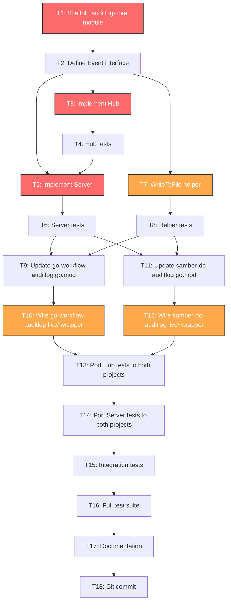

# Auditlog Core Extraction Plan

> Extract shared infrastructure from `go-workflow-auditlog` and `samber-do-auditlog`
> into a new `github.com/larsartmann/auditlog-core` module.

---

## Pareto Analysis

### 1% that delivers 51%: SSE Hub Extraction

The `live/hub.go` file is **156 LOC, byte-for-byte identical** across both projects.
It is pure infrastructure (SSE fan-out, subscriber management, concurrent broadcast)
with zero domain coupling. Extracting it proves the pattern, eliminates the largest
single duplicate, and unblocks the Server extraction.

**Files:** `live/hub.go` (both projects, 156 LOC each)

### 4% that delivers 64%: Server + Helpers

Adding `live/server.go` (200 LOC, ~90% identical) and `helpers.go` (131 LOC, identical)
covers the remaining infrastructure. The Server becomes generic via callbacks instead
of concrete `*Auditor`/`*Plugin` references. `WriteToFile` (atomic temp+rename) is
a universally useful primitive.

**Files:** `live/server.go` (both, 200 LOC), `helpers.go` (both, 131 LOC)

### 20% that delivers 80%: NDJSON + Loader

The NDJSON read/write (`ndjson.go`, `export.go`) and format detection (`loader.go`)
are identical across projects but have tighter coupling to the Event type. These are
**phase 2** work: extract after the core SSE infrastructure is proven.

**Files:** `ndjson.go` (87 LOC), `export.go` (45 LOC), `loader.go` (175 LOC)

### 80% that does NOT justify extraction: Domain Logic

The following are **intentionally different** between projects and should NOT be extracted:

| File | Why Accept |
|------|-----------|
| `event.go` | Different struct fields (StepRef vs ServiceRef), different predicates |
| `filter.go` | Different filter fields (step names/statuses vs service names/types/scope) |
| `diff.go` | Different comparison keys and diff fields |
| `daghtml_adapter.go` | Different node construction, different color mappings |
| `live/dashboard.go` | Domain-specific HTML templates, different tabs/columns |
| `plugin.go` / `hooks.go` | Completely different integration patterns (flow hooks vs do hooks) |

---

## Architecture

### What Changes

```
BEFORE:
  go-workflow-auditlog/live/hub.go      (156 LOC, identical)
  go-workflow-auditlog/live/server.go   (200 LOC, ~90% identical)
  go-workflow-auditlog/helpers.go       (131 LOC, identical)
  samber-do-auditlog/live/hub.go        (156 LOC, identical)
  samber-do-auditlog/live/server.go     (200 LOC, ~90% identical)
  samber-do-auditlog/helpers.go         (131 LOC, identical)
  TOTAL DUPLICATED: ~874 LOC

AFTER:
  auditlog-core/live/hub.go             (156 LOC, shared)
  auditlog-core/live/server.go          (220 LOC, shared with Prefix feature)
  auditlog-core/helpers.go              (131 LOC, shared)
  go-workflow-auditlog/live/            (thin wrapper, ~40 LOC)
  samber-do-auditlog/live/              (thin wrapper, ~40 LOC)
  TOTAL DUPLICATED: 0 LOC
  NET REDUCTION: ~800 LOC
```

### Dependency Direction

```
go-workflow-auditlog ──depends on──> auditlog-core
samber-do-auditlog   ──depends on──> auditlog-core
```

### Generic Server Design

The core Server does NOT depend on any auditlog implementation. It uses callbacks:

```go
// auditlog-core/live/server.go
type Config struct {
    Addr              string
    Prefix            string        // adopted from samber-do (strictly better)
    ReadHeaderTimeout time.Duration
    HeartbeatInterval time.Duration
}

type ReportProvider func() ([]byte, error)
type OnEventFunc func(json.RawMessage)

type Server struct { /* hub, config, httpServer, mux */ }

func New(hub *Hub, reportProvider ReportProvider, cfg Config) *Server
func NewWithCallbacks(reportProvider ReportProvider, onEvent OnEventFunc, cfg Config) (*Server, *Hub)
func (s *Server) ListenAndServe() error
func (s *Server) Shutdown(ctx context.Context) error
func (s *Server) SignalComplete()
func (s *Server) OnEvent(evt json.RawMessage)
func (s *Server) Addr() string
```

Each project's `live/` becomes a thin wrapper:

```go
// go-workflow-auditlog/live/server.go (wrapper)
func New(auditCfg auditlog.Config, serverCfg Config) (*Server, *auditlog.Auditor, error) {
    hub := corelive.NewHub()
    auditCfg.OnEvent = func(evt auditlog.Event) {
        data, _ := json.Marshal(evt)
        hub.OnEvent(data)
    }
    auditor, _ := auditlog.New(auditCfg)
    reportProvider := func() ([]byte, error) {
        var buf bytes.Buffer
        err := auditor.Report().WriteJSON(&buf)
        return buf.Bytes(), err
    }
    coreServer := corelive.New(hub, reportProvider, toCoreConfig(serverCfg))
    return &Server{core: coreServer}, auditor, nil
}
```

---

## Execution Graph



**Red** = highest impact (1% delivers 51%)
**Orange** = high impact (4% delivers 64%)

---

## Task Table (10-30 min each)

| # | Task | Est. | Impact | Dependencies | Files Touched |
|---|------|------|--------|--------------|---------------|
| T1 | Scaffold auditlog-core module | 10m | HIGH | None | `auditlog-core/go.mod`, `auditlog-core/live/doc.go` |
| T2 | Define Event interface in core | 10m | HIGH | T1 | `auditlog-core/live/event.go` |
| T3 | Implement Hub (port from both) | 25m | **CRITICAL** | T2 | `auditlog-core/live/hub.go` |
| T4 | Hub unit tests | 20m | HIGH | T3 | `auditlog-core/live/hub_test.go` |
| T5 | Implement Server (generic, with Prefix) | 30m | **CRITICAL** | T2, T3 | `auditlog-core/live/server.go` |
| T6 | Server unit tests | 25m | HIGH | T5 | `auditlog-core/live/server_test.go` |
| T7 | WriteToFile + helpers extraction | 15m | MEDIUM | T1 | `auditlog-core/helpers.go` |
| T8 | Helper tests | 10m | MEDIUM | T7 | `auditlog-core/helpers_test.go` |
| T9 | Update go-workflow-auditlog go.mod | 5m | HIGH | T1 | `go-workflow-auditlog/go.mod` |
| T10 | Wire go-workflow-auditlog live/ wrapper | 25m | HIGH | T5, T9 | `go-workflow-auditlog/live/*.go` |
| T11 | Update samber-do-auditlog go.mod | 5m | HIGH | T1 | `samber-do-auditlog/go.mod` |
| T12 | Wire samber-do-auditlog live/ wrapper | 25m | HIGH | T5, T11 | `samber-do-auditlog/live/*.go` |
| T13 | Port Hub tests to both projects | 20m | MEDIUM | T10, T12 | Both `live/server_test.go` |
| T14 | Port Server tests to both projects | 25m | MEDIUM | T13 | Both `live/server_test.go` |
| T15 | Integration tests (both projects) | 20m | MEDIUM | T14 | Both `live/*_test.go` |
| T16 | Full test suite + lint | 15m | HIGH | T15 | All |
| T17 | Documentation (AGENTS.md, README) | 15m | LOW | T16 | `auditlog-core/README.md`, both `AGENTS.md` |
| T18 | Git commit | 10m | LOW | T17 | All |

**Total estimated time: ~5.5 hours**

---

## Sub-Task Breakdown (max 12 min each)

### T1: Scaffold auditlog-core module

| # | Sub-Task | Est. |
|---|----------|------|
| T1.1 | Create directory structure: `auditlog-core/`, `auditlog-core/live/` | 2m |
| T1.2 | Write `go.mod` (module path, go 1.26.4, `encoding/json` only) | 3m |
| T1.3 | Write `live/doc.go` (package doc, SSE architecture) | 3m |
| T1.4 | Write root `doc.go` | 2m |
| T1.5 | Verify `go build ./...` passes | 2m |

### T2: Define Event interface

| # | Sub-Task | Est. |
|---|----------|------|
| T2.1 | Design `Event` interface (Sequence, Timestamp, Error) | 4m |
| T2.2 | Write `live/event.go` with interface + doc | 4m |
| T2.3 | Verify `go build ./...` passes | 2m |

### T3: Implement Hub

| # | Sub-Task | Est. |
|---|----------|------|
| T3.1 | Port `subscriber` struct (identical in both) | 3m |
| T3.2 | Port `Hub` struct (change `*auditlog.Auditor` to callbacks) | 4m |
| T3.3 | Port `OnEvent` broadcast (use `json.RawMessage` instead of `auditlog.Event`) | 3m |
| T3.4 | Port `Subscribe`/`Unsubscribe`/`SignalComplete`/`IsComplete`/`ClientCount` | 4m |
| T3.5 | Verify `go build ./...` passes | 2m |

### T4: Hub tests

| # | Sub-Task | Est. |
|---|----------|------|
| T4.1 | Port test helpers (mock subscriber, event factory) | 4m |
| T4.2 | Port `OnEvent` broadcast tests | 4m |
| T4.3 | Port `Subscribe`/`Unsubscribe` lifecycle tests | 4m |
| T4.4 | Port `SignalComplete` + concurrent safety tests | 4m |
| T4.5 | Run `go test ./live/` | 2m |

### T5: Implement Server

| # | Sub-Task | Est. |
|---|----------|------|
| T5.1 | Define `Config`, `ReportProvider`, `OnEventFunc` types | 4m |
| T5.2 | Define `Server` struct (no domain imports) | 3m |
| T5.3 | Implement `New()` + `NewWithCallbacks()` constructors | 4m |
| T5.4 | Implement `setupRoutes()` with Prefix support (from samber-do) | 3m |
| T5.5 | Implement `ListenAndServe()` + `Addr()` + `Shutdown()` | 4m |
| T5.6 | Implement `SignalComplete()` + `OnEvent()` delegates | 2m |
| T5.7 | Implement `handleReport` (call ReportProvider, write JSON) | 3m |
| T5.8 | Implement `handleSSE` (snapshot + live events + completion) | 5m |
| T5.9 | Implement `handleHealth` | 2m |
| T5.10 | Implement `handleDashboard` (serve embedded HTML) | 3m |
| T5.11 | Verify `go build ./...` passes | 2m |

### T6: Server tests

| # | Sub-Task | Est. |
|---|----------|------|
| T6.1 | Port `TestNew`/`TestNewServer` constructor tests | 4m |
| T6.2 | Port `TestListenAndServe` + `TestAddr` lifecycle tests | 4m |
| T6.3 | Port `TestHandleReport` endpoint test | 3m |
| T6.4 | Port `TestHandleSSE` (snapshot, event, complete) | 5m |
| T6.5 | Port `TestHandleHealth` | 2m |
| T6.6 | Run `go test ./live/` | 2m |

### T7: WriteToFile + helpers

| # | Sub-Task | Est. |
|---|----------|------|
| T7.1 | Port `WriteToFile` (atomic temp+rename) | 4m |
| T7.2 | Port `CheckNoClobber` + `ErrFileExists` | 3m |
| T7.3 | Port `fileWriteBufferSize` constant | 1m |
| T7.4 | Verify `go build ./...` passes | 2m |

### T8: Helper tests

| # | Sub-Task | Est. |
|---|----------|------|
| T8.1 | Port `TestWriteToFile` (success, error, atomicity) | 4m |
| T8.2 | Port `TestCheckNoClobber` (exists, not exists, error) | 3m |
| T8.3 | Run `go test ./...` | 2m |

### T9-T12: Wire both projects

| # | Sub-Task | Est. |
|---|----------|------|
| T9.1 | Add `require github.com/larsartmann/auditlog-core` to go-workflow-auditlog | 2m |
| T10.1 | Create `live/adapter.go` (wrapper types: `Server`, `Config`) | 5m |
| T10.2 | Create `live/constructor.go` (`New`, `NewServer` thin wrappers) | 5m |
| T10.3 | Delete old `live/hub.go`, `live/server.go` (keep `dashboard.go`, `doc.go`, CSS/JS) | 3m |
| T10.4 | Verify `go build ./...` passes | 2m |
| T11.1 | Add `require github.com/larsartmann/auditlog-core` to samber-do-auditlog | 2m |
| T12.1 | Create `live/adapter.go` (wrapper types: `Server`, `Config`) | 5m |
| T12.2 | Create `live/constructor.go` (`New`, `NewServer` thin wrappers) | 5m |
| T12.3 | Delete old `live/hub.go`, `live/server.go` (keep `dashboard.go`, `doc.go`, CSS/JS, `base_css.go`) | 3m |
| T12.4 | Verify `go build ./...` passes | 2m |

### T13-T16: Test & Verify

| # | Sub-Task | Est. |
|---|----------|------|
| T13.1 | Port Hub tests to go-workflow-auditlog/live/ | 5m |
| T13.2 | Port Hub tests to samber-do-auditlog/live/ | 5m |
| T13.3 | Run both test suites | 3m |
| T14.1 | Port Server tests to go-workflow-auditlog/live/ | 6m |
| T14.2 | Port Server tests to samber-do-auditlog/live/ | 6m |
| T14.3 | Run both test suites | 3m |
| T15.1 | Write integration test: full SSE lifecycle (go-workflow) | 5m |
| T15.2 | Write integration test: full SSE lifecycle (samber-do) | 5m |
| T15.3 | Run integration tests | 3m |
| T16.1 | Run `go test ./...` in auditlog-core | 2m |
| T16.2 | Run `go test ./...` in go-workflow-auditlog | 2m |
| T16.3 | Run `go test ./...` in samber-do-auditlog | 2m |
| T16.4 | Run `golangci-lint run` in all three projects | 4m |
| T16.5 | Fix any lint issues | 5m |

### T17-T18: Docs & Commit

| # | Sub-Task | Est. |
|---|----------|------|
| T17.1 | Write `auditlog-core/README.md` | 5m |
| T17.2 | Update both `AGENTS.md` with auditlog-core reference | 4m |
| T17.3 | Update both `FEATURES.md` | 3m |
| T18.1 | `git status` + `git diff` in all three repos | 2m |
| T18.2 | Commit auditlog-core (initial module) | 3m |
| T18.3 | Commit go-workflow-auditlog (use auditlog-core) | 3m |
| T18.4 | Commit samber-do-auditlog (use auditlog-core) | 3m |

---

## Risk Assessment

| Risk | Mitigation |
|------|-----------|
| Import cycles | Core module has ZERO imports from either auditlog project |
| API breakage | Both projects keep `live/` as thin wrappers preserving existing API |
| Test regression | Port tests incrementally, run after each change |
| Dashboard divergence | Dashboard code stays in each project (domain-specific) |
| Prefix feature gap | Adopt samber-do's Prefix feature in core (strictly better) |

---

## Success Criteria

- [ ] `auditlog-core` compiles with zero domain dependencies
- [ ] Hub broadcasts events to concurrent SSE clients
- [ ] Server serves dashboard, report, SSE, and health endpoints
- [ ] Both projects import auditlog-core and pass all existing tests
- [ ] Zero duplicated infrastructure LOC between the two projects
- [ ] All lint checks pass
