# SUPERB go-sse Adoption Plan

**Date:** 2026-08-06  
**Context:** go-sse deep-dive audit found 22/100 adoption score — 3 of ~40 exported symbols used.  
**Source:** [go-sse deep-dive report](../research/2026-08-06_go-sse-deep-dive.html)  
**Goal:** Raise adoption from 22 → 85+ by adopting Stream, Broadcaster, and Replay — eliminating ~200 lines of hand-rolled infrastructure while preserving all existing behavior.

---

## Pareto Breakdown

### The 1% that delivers 51% of the result

**Adopt `sse.Stream` in `handleSSE`.** One function. Eliminates manual flusher check, manual headers (4 lines), manual flush calls (4 sites), manual heartbeat bytes. Unlocks `SendJSON`, `Heartbeat(ctx, interval)` goroutine, `LastEventID()`, `OnDisconnect()`, `io.Closer`. This is the keystone — every subsequent improvement builds on Stream being in place.

### The 4% that delivers 64% of the result

**Replace `Hub` with `sse.Broadcaster[sse.Event]` + thin domain layer.** Eliminates 137 lines of `hub.go` (functional duplicate of Broadcaster). Gains `Shutdown(ctx)` (graceful drain), `Health()` (structured snapshot), `BroadcastMany()` (batch), `WithBufferSize[T](128)` (configurable buffer). The domain layer preserves `SignalComplete`/`IsComplete`/`Done()` — go-sse has no concept of DI lifecycle completion.

### The 20% that delivers 80% of the result

**Add reconnection replay via `EventStore` + `Replay`.** ~15-line adapter over `plugin.Events()`. Tag broadcast events with sequential IDs. Call `sse.Replay(stream, store, stream.LastEventID())` before subscribing to live events. Clients that disconnect and reconnect no longer lose events.

### The remaining 20% to reach 100%

- Use `stream.SendJSON()` in `sendSnapshot`/`sendComplete` (eliminate manual marshal+WriteEvent+Flush)
- Chain `broadcaster.Shutdown(ctx)` after `http.Server.Shutdown(ctx)` (graceful drain on server stop)
- Enrich `/api/health` with `BroadcasterHealth` fields (`Draining`, `BufferSize`)
- Upgrade `go.mod` from v0.3.0 → v0.4.0 (prerequisite for Shutdown/Health)
- Fix AGENTS.md version drift (says v0.2.1, go.mod says v0.3.0, latest is v0.4.0)
- Update FEATURES.md, CHANGELOG.md
- Rewrite Hub unit tests for new implementation
- Update SSE handler tests for Stream-based handler

---

## Architecural Decisions

### AD1: Broadcaster type parameter = `sse.Event`

The Hub broadcasts already-marshaled JSON (`json.RawMessage`). The refactored Hub will broadcast `sse.Event` directly — the `OnEvent` callback marshals `auditlog.Event` to JSON and constructs `sse.Event{Event: "event", Data: string(payload), ID: ...}`. The handler receives `sse.Event` and calls `stream.Send(evt)` with zero conversion.

**Rejected:** `Broadcaster[json.RawMessage]` — requires re-wrapping to `sse.Event` in the handler.  
**Rejected:** `Broadcaster[auditlog.Event]` — requires marshal + sse.Event construction in every handler.

### AD2: Hub becomes a facade wrapping Broadcaster

The public API (`NewHub()`, `hub.OnEvent()`, `hub.SignalComplete()`, `hub.IsComplete()`, `hub.ClientCount()`) is preserved. Internally, Hub wraps `*sse.Broadcaster[sse.Event]` + `atomic.Bool` for completion + `chan struct{}` for done signal. The `Subscriber` struct disappears — callers use `<-chan sse.Event` directly from `Broadcaster.Subscribe()`.

**Rationale:** Minimal blast radius. Tests that call `NewHub()` still compile. Only tests that directly access `Subscriber` fields need updating. The demo (`live/demo/main.go`) only uses `Server.SignalComplete()` — unchanged.

### AD3: Flusher check preserved before Stream creation

`sse.NewStream` always writes 200 OK, so we can't return 500 after it. The existing `TestServer_HandleSSE_NoFlusher` expects a 500 response. Solution: keep the flusher interface check before calling `NewStream`. One `if` statement, preserves the test.

### AD4: Replay subscribes-first to avoid event gap

```
1. ch := broadcaster.Subscribe()     // start buffering live events
2. sse.Replay(stream, store, lastID) // replay missed events
3. enter event loop (drain ch)       // live events continue
```

Events that arrived between steps 1 and 2 are both replayed AND in the channel buffer. The client deduplicates via Event ID (standard SSE reconnection semantics). This is the canonical go-sse pattern from `example/server.go`.

### AD5: EventStore snapshot taken at handler entry

The `EventStore` adapter wraps `plugin.Events()` — a snapshot of all recorded events at call time. This is correct because:
- Events before the handler call are in the snapshot (replayed)
- Events after the handler call arrive via the live channel
- Events between snapshot and subscribe arrive via both (deduplicated by client)

---

## Execution Graph

```mermaid
graph TD
    %% Phase 0: Preparation
    P0A["Phase 0A: Upgrade go.mod<br/>v0.3.0 → v0.4.0"] --> P0B["Phase 0B: Fix AGENTS.md<br/>version drift"]
    P0B --> P1A

    %% Phase 1: Stream adoption (the 1%)
    P1A["Phase 1A: Refactor handleSSE<br/>to use sse.Stream"] --> P1B["Phase 1B: Refactor sendSnapshot<br/>to use stream.SendJSON"]
    P1B --> P1C["Phase 1C: Refactor sendComplete<br/>to use stream.SendJSON"]
    P1C --> P1D["Phase 1D: Update SSE handler tests"]
    P1D --> P1E["Phase 1E: Run full test suite"]
    P1E --> P2A

    %% Phase 2: Broadcaster adoption (the 4%)
    P2A["Phase 2A: Rewrite Hub as<br/>Broadcaster facade"] --> P2B["Phase 2B: Update Server<br/>to use new Hub"]
    P2B --> P2C["Phase 2C: Update handleSSE<br/>for Broadcaster API"]
    P2C --> P2D["Phase 2D: Rewrite Hub unit tests"]
    P2D --> P2E["Phase 2E: Run full test suite"]
    P2E --> P3A

    %% Phase 3: Replay (the 20%)
    P3A["Phase 3A: Implement EventStore<br/>adapter"] --> P3B["Phase 3B: Add event IDs<br/>to OnEvent broadcasts"]
    P3B --> P3C["Phase 3C: Wire Replay into<br/>handleSSE"]
    P3C --> P3D["Phase 3D: Add replay tests"]
    P3D --> P3E["Phase 3E: Run full test suite"]
    P3E --> P4A

    %% Phase 4: Polish (remaining 20%)
    P4A["Phase 4A: Add broadcaster.Shutdown<br/>to Server.Shutdown"] --> P4B["Phase 4B: Enrich health endpoint<br/>with BroadcasterHealth"]
    P4B --> P4C["Phase 4C: Update FEATURES.md<br/>+ CHANGELOG.md"]
    P4C --> P4D["Phase 4D: Update AGENTS.md<br/>architecture section"]
    P4D --> P4E["Phase 4E: Final full test<br/>+ lint + coverage gate"]

    %% Styling
    classDef phase0 fill:#f4d35e,stroke:#333,stroke-width:2px
    classDef phase1 fill:#e63946,stroke:#333,stroke-width:2px,color:#fff
    classDef phase2 fill:#e63946,stroke:#333,stroke-width:2px,color:#fff
    classDef phase3 fill:#1d3557,stroke:#333,stroke-width:2px,color:#fff
    classDef phase4 fill:#1d3557,stroke:#333,stroke-width:2px,color:#fff

    class P0A,P0B phase0
    class P1A,P1B,P1C,P1D,P1E phase1
    class P2A,P2B,P2C,P2D,P2E phase2
    class P3A,P3B,P3C,P3D,P3E phase3
    class P4A,P4B,P4C,P4D,P4E phase4
```



**Legend:** 🟡 Phase 0 (Prep) · 🔴 Phase 1-2 (1% + 4% — the Pareto core) · 🔵 Phase 3-4 (20% — replay + polish)

---

## Medium-Granularity Plan (30–100 min per task)

| # | Phase | Task | Impact (1-5) | Effort (min) | Priority | Dependencies |
|---|-------|------|:---:|:---:|:---:|---|
| 1 | 0 | **Upgrade go.mod v0.3.0 → v0.4.0** — `go get github.com/larsartmann/go-sse@v0.4.0 && go mod tidy`. Verify build. | 4 | 15 | 60 | — |
| 2 | 0 | **Fix AGENTS.md version drift** — Update all v0.2.1 references to v0.4.0 (lines 122, 160). | 2 | 15 | 30 | #1 |
| 3 | 1 | **Refactor `handleSSE` to use `sse.Stream`** — Replace manual headers/flusher/flush/heartbeat with `NewStream` + `Send` + `go Heartbeat`. Keep flusher check before NewStream (AD3). | 5 | 60 | 300 | #1 |
| 4 | 1 | **Refactor `sendSnapshot` to use `stream.SendJSON`** — Replace manual marshal+WriteEvent+Flush with one `SendJSON` call. | 3 | 30 | 90 | #3 |
| 5 | 1 | **Refactor `sendComplete` to use `stream.SendJSON`** — Same pattern as sendSnapshot. | 3 | 30 | 90 | #3 |
| 6 | 1 | **Update SSE handler tests for Stream** — Update tests that assert on raw SSE bytes (heartbeat, headers). `TestServer_HandleSSE_NoFlusher` should still pass. | 4 | 60 | 240 | #3,4,5 |
| 7 | 1 | **Run full test suite after Phase 1** — `go test -race ./...`. Fix any failures. | 5 | 30 | 150 | #6 |
| 8 | 2 | **Rewrite `Hub` as Broadcaster facade** — Replace `Hub.clients` map + `Subscriber` struct with `*sse.Broadcaster[sse.Event]`. Preserve `NewHub()`, `OnEvent()`, `SignalComplete()`, `IsComplete()`, `ClientCount()`. Add `Subscribe()` returning `<-chan sse.Event`, `Unsubscribe(ch)`, `Done()`, `Shutdown(ctx)`. ~50 lines. | 5 | 90 | 450 | #7 |
| 9 | 2 | **Update `Server` for new Hub API** — Change `Server.hub` usage. `handleSSE` subscribes via `hub.Subscribe()` returning `<-chan sse.Event`. `handleHealth` uses `hub.ClientCount()`/`hub.IsComplete()`. | 4 | 45 | 180 | #8 |
| 10 | 2 | **Rewrite Hub unit tests** — Update `TestHub_*` tests (5 tests) for new channel-based API. Remove `Subscriber` struct references. | 4 | 45 | 180 | #8 |
| 11 | 2 | **Run full test suite after Phase 2** — `go test -race ./...`. Fix any failures. | 5 | 30 | 150 | #9,10 |
| 12 | 3 | **Implement `EventStore` adapter** — ~15-line struct wrapping `[]auditlog.Event`. `EventsAfter(lastID)` filters by sequence number, returns `[]sse.Event`. | 4 | 30 | 120 | #11 |
| 13 | 3 | **Add event IDs to `Hub.OnEvent`** — Assign sequential IDs via `atomic.Int64`. Tag `sse.Event.ID` with `sse.NewEventID(strconv.FormatInt(seq, 10))`. | 4 | 30 | 120 | #11 |
| 14 | 3 | **Wire Replay into `handleSSE`** — After Stream creation + before live loop: subscribe to broadcaster, call `sse.Replay(stream, store, stream.LastEventID())`, then enter event loop. | 5 | 45 | 225 | #12,13 |
| 15 | 3 | **Add replay tests** — Test reconnection: connect, receive events, disconnect, reconnect with Last-Event-ID, verify missed events replayed. | 4 | 60 | 240 | #14 |
| 16 | 3 | **Run full test suite after Phase 3** — `go test -race ./...`. Fix any failures. | 5 | 30 | 150 | #15 |
| 17 | 4 | **Add `broadcaster.Shutdown(ctx)` to `Server.Shutdown`** — Chain after `http.Server.Shutdown(ctx)`. Graceful drain of subscriber buffers. | 3 | 30 | 90 | #16 |
| 18 | 4 | **Enrich `/api/health` with `BroadcasterHealth`** — Add `draining`, `buffer_size` fields from `hub.Health()`. | 2 | 30 | 60 | #16 |
| 19 | 4 | **Update FEATURES.md + CHANGELOG.md** — Document go-sse adoption: Stream, Broadcaster, Replay, Shutdown, Health. | 3 | 30 | 90 | #17,18 |
| 20 | 4 | **Update AGENTS.md architecture section** — Rewrite `live/hub.go` description. Add replay documentation. Update go-sse description (no longer "wire-format primitives only"). | 3 | 30 | 90 | #17,18 |
| 21 | 4 | **Final full quality gate** — `go test -race -coverprofile=cover.out ./...` + `golangci-lint run` + coverage ≥94%. | 5 | 30 | 150 | #19,20 |

**Total estimated effort:** ~13.5 hours  
**Pareto core (tasks 1-11):** ~8 hours (59% of effort, 80% of value)

---

## Fine-Granularity Plan (max 12 min per task)

### Phase 0: Preparation (2 tasks, ~25 min)

| # | Task | Est | Dep |
|---|------|:---:|---|
| F1 | `GOTOOLCHAIN=go1.26.5 go get github.com/larsartmann/go-sse@v0.4.0` | 5m | — |
| F2 | `GOTOOLCHAIN=go1.26.5 go mod tidy` + verify `go build ./...` | 5m | F1 |
| F3 | Update AGENTS.md line 122: `v0.2.1` → `v0.4.0` | 2m | F2 |
| F4 | Update AGENTS.md line 160: `v0.2.1` → `v0.4.0` (toolchain section) | 2m | F3 |
| F5 | Update CHANGELOG.md `[Unreleased]`: add go-sse v0.4.0 upgrade entry | 5m | F4 |

### Phase 1: Stream Adoption (12 tasks, ~80 min)

| # | Task | Est | Dep |
|---|------|:---:|---|
| F6 | Read `handleSSE` (server.go:375-425) and map each manual step to Stream equivalent | 10m | F5 |
| F7 | Add `sse` import alias if not already present (already imported) | 1m | F6 |
| F8 | Replace manual header setting (lines 383-386) with comment: "Stream sets headers" | 2m | F6 |
| F9 | Add `stream := sse.NewStream(w, r)` + `defer func() { _ = stream.Close() }()` | 3m | F8 |
| F10 | Keep flusher check before NewStream — `if _, ok := w.(http.Flusher); !ok { http.Error(...); return }` | 3m | F9 |
| F11 | Replace `sendSnapshot(w, flusher)` signature → `sendSnapshot(stream *sse.Stream)` | 5m | F10 |
| F12 | Replace `sendComplete(w, flusher)` signature → `sendComplete(stream *sse.Stream)` | 5m | F11 |
| F13 | Replace manual event write+flush (line 411) → `stream.Send(sse.Event{Event: "event", Data: string(evt)})` | 3m | F12 |
| F14 | Replace manual heartbeat (lines 417-422) → `go stream.Heartbeat(stream.Context(), srv.config.HeartbeatInterval)` (outside loop) | 5m | F13 |
| F15 | Replace `ctx := r.Context()` → `ctx := stream.Context()` | 2m | F14 |
| F16 | Replace `flusher.Flush()` calls in sendSnapshot/sendComplete — Stream.Send handles flush | 5m | F14 |
| F17 | Verify `go build ./live/...` compiles | 2m | F16 |
| F18 | Run SSE handler tests: `go test -race -run TestServer_SSE ./live/...` | 5m | F17 |
| F19 | Fix any test failures from wire-format changes | 10m | F18 |
| F20 | Run `TestServer_HandleSSE_NoFlusher` — verify 500 behavior preserved | 3m | F19 |

### Phase 2: Broadcaster Adoption (15 tasks, ~110 min)

| # | Task | Est | Dep |
|---|------|:---:|---|
| F21 | Rewrite `Hub` struct: replace `clients map` + `nextID` with `bc *sse.Broadcaster[sse.Event]` + `seq atomic.Int64` + `complete atomic.Bool` + `doneCh chan struct{}` | 10m | F20 |
| F22 | Rewrite `NewHub()`: construct `sse.NewBroadcaster[sse.Event](sse.WithBufferSize[sse.Event](128))` | 3m | F21 |
| F23 | Rewrite `Hub.OnEvent()`: marshal evt → construct `sse.Event` with seq ID → `bc.Broadcast(evt)` | 5m | F22 |
| F24 | Add `Hub.Subscribe() <-chan sse.Event`: delegate to `bc.Subscribe()` | 3m | F23 |
| F25 | Add `Hub.Unsubscribe(ch <-chan sse.Event)`: delegate to `bc.Unsubscribe(ch)` | 3m | F24 |
| F26 | Add `Hub.Done() <-chan struct{}`: return `h.doneCh` | 2m | F25 |
| F27 | Rewrite `Hub.SignalComplete()`: `CompareAndSwap` + `close(doneCh)` | 3m | F26 |
| F28 | Rewrite `Hub.IsComplete()`: `return h.complete.Load()` | 2m | F27 |
| F29 | Rewrite `Hub.ClientCount()`: delegate to `bc.SubscriberCount()` | 2m | F28 |
| F30 | Add `Hub.Shutdown(ctx) error`: delegate to `bc.Shutdown(ctx)` | 3m | F29 |
| F31 | Add `Hub.Health() sse.BroadcasterHealth`: delegate to `bc.Health()` | 2m | F30 |
| F32 | Delete `Subscriber` struct + `closeDone()` + `ID()` + `Events()` + `Done()` methods | 5m | F31 |
| F33 | Update `handleSSE`: `ch := srv.hub.Subscribe()` + `defer srv.hub.Unsubscribe(ch)` + `<-ch` instead of `<-sub.ch` | 5m | F32 |
| F34 | Update `handleSSE`: `<-srv.hub.Done()` instead of `<-sub.done` | 3m | F33 |
| F35 | Verify `go build ./live/...` compiles | 2m | F34 |

### Phase 2: Tests (8 tasks, ~55 min)

| # | Task | Est | Dep |
|---|------|:---:|---|
| F36 | Rewrite `TestHub_SubscribeUnsubscribe`: use `hub.Subscribe()` returning `<-chan sse.Event` + `hub.Unsubscribe(ch)` | 8m | F35 |
| F37 | Rewrite `TestHub_OnEventDelivery`: broadcast → receive from channel → unmarshal → verify | 8m | F36 |
| F38 | Rewrite `TestHub_SignalComplete`: use `hub.Done()` instead of `sub.Done()` | 5m | F37 |
| F39 | Rewrite `TestHub_BufferOverflow`: send 129 events to buffer-128 broadcaster, verify drop | 8m | F38 |
| F40 | Update `TestHub_UnsubscribeUnknownID` → `TestHub_UnsubscribeUnknownChannel` (unsubscribe a never-subscribed channel) | 5m | F39 |
| F41 | Update `newTestServer` + `TestServer_CustomPrefix` + `TestServer_RootPrefix`: `hub.OnEvent` wiring unchanged | 3m | F40 |
| F42 | Run `go test -race ./live/...` — fix any failures | 10m | F41 |
| F43 | Run `go test -race ./...` — full suite green | 5m | F42 |

### Phase 3: Reconnection Replay (10 tasks, ~70 min)

| # | Task | Est | Dep |
|---|------|:---:|---|
| F44 | Create `live/replay.go`: `type eventStore struct { events []auditlog.Event }` | 5m | F43 |
| F45 | Implement `EventsAfter(lastID sse.EventID) ([]sse.Event, error)`: parse lastID as int64, filter events by sequence, construct sse.Events with IDs | 10m | F44 |
| F46 | Verify `Hub.OnEvent` assigns sequential IDs (already done in F23) — verify ID format matches EventStore expectations | 3m | F45 |
| F47 | Update `handleSSE`: after Stream creation, before live loop — extract `lastID := stream.LastEventID()` | 3m | F46 |
| F48 | Update `handleSSE`: if `!lastID.IsZero()` — construct eventStore from `srv.plugin.Events()`, call `sse.Replay(stream, &store, lastID)` | 8m | F47 |
| F49 | Update `handleSSE`: subscribe to broadcaster BEFORE replay (AD4: subscribe-first pattern) | 5m | F48 |
| F50 | Verify dashboard.js handles event IDs gracefully (EventSource auto-sends Last-Event-ID) | 5m | F49 |
| F51 | Write `TestServer_SSE_ReconnectReplay`: connect, receive events, disconnect, reconnect with Last-Event-ID, verify replay | 12m | F50 |
| F52 | Write `TestServer_SSE_ReconnectNoLastID`: reconnect without Last-Event-ID → full snapshot, no replay | 8m | F51 |
| F53 | Run `go test -race ./live/...` — fix any failures | 5m | F52 |

### Phase 4: Polish (12 tasks, ~80 min)

| # | Task | Est | Dep |
|---|------|:---:|---|
| F54 | Update `Server.Shutdown`: add `srv.hub.Shutdown(ctx)` after `http.Server.Shutdown(ctx)` | 5m | F53 |
| F55 | Write `TestServer_GracefulShutdown_DrainsBuffers`: verify subscriber buffers drain before close | 10m | F54 |
| F56 | Update `healthResponse` struct: add `Draining bool` + `BufferSize int` JSON fields | 3m | F55 |
| F57 | Update `handleHealth`: populate from `srv.hub.Health()` | 5m | F56 |
| F58 | Update `TestServer_HealthEndpoint`: verify new fields present | 5m | F57 |
| F59 | Update FEATURES.md: add "SSE reconnection replay" + "go-sse Broadcaster adoption" rows | 8m | F58 |
| F60 | Update CHANGELOG.md `[Unreleased]`: document Stream/Broadcaster/Replay/Shutdown/Health adoption | 8m | F59 |
| F61 | Update AGENTS.md `live/` file list: rewrite hub.go description, add replay.go | 5m | F60 |
| F62 | Update AGENTS.md go-sse section: "wire-format primitives" → "full SSE lifecycle (Stream, Broadcaster, Replay)" | 5m | F61 |
| F63 | Update AGENTS.md gotchas: remove "Hub implements fan-out" if present, add "EventStore adapter for replay" | 5m | F62 |
| F64 | Run full quality gate: `GOEXPERIMENT=jsonv2 go test -race -coverprofile=cover.out -covermode=atomic ./...` | 5m | F63 |
| F65 | Verify coverage ≥94%: `sh scripts/coverage-gate.sh` | 5m | F64 |

---

## Risk Assessment

| Risk | Likelihood | Impact | Mitigation |
|------|:---:|:---:|---|
| **SSE wire format changes break dashboard.js** | Medium | High | Dashboard JS reads `event.addEventListener("snapshot"/"event"/"complete", ...)`. Event names are preserved. Data payloads are identical JSON. Only addition is `id:` field — EventSource ignores unknown fields. |
| **Concurrency regression (Stream mutex vs select-based safety)** | Low | High | Stream uses `sync.Mutex` for write serialization. Current code is safe via single-goroutine select. Stream's approach is strictly safer (handles concurrent Send + Heartbeat). |
| **Hub public API changes break tests** | Medium | Medium | Hub facade preserves `NewHub()`, `OnEvent()`, `SignalComplete()`, `IsComplete()`, `ClientCount()`. Only `Subscribe()`/`Unsubscribe()` return types change (channel-based). 5 Hub tests need rewriting. |
| **Replay race condition (gap between subscribe and replay)** | Low | Medium | Subscribe-first pattern (AD4) ensures no gap. Duplicates handled by client-side Event ID deduplication. |
| **Coverage drops below 94% gate** | Low | Medium | New code (eventStore, replay path) must have tests. Hub facade tests replace old Hub tests. All new paths tested. |
| **go-sse v0.4.0 API breaking change from v0.3.0** | Very Low | Low | v0.3.0 was a checkpoint release with zero code changes. v0.4.0 is additive only (SubscribeFilter, Shutdown, Health, KeyedLines). No breaking changes. |

---

## Verschlimmbesserung Checklist

Before merging any phase, verify:

- [ ] Dashboard loads and renders correctly (manual check via `go run ./example --live`)
- [ ] All 36 existing `live/` tests pass without modification (Phase 1 only)
- [ ] Event names unchanged: "snapshot", "event", "complete"
- [ ] JSON payloads unchanged: `snapshotData`, `completeData` structs
- [ ] `/api/health` still returns valid JSON
- [ ] `TestServer_HandleSSE_NoFlusher` still returns 500
- [ ] Heartbeat interval configurable via `Config.HeartbeatInterval`
- [ ] No new dependencies introduced (go-sse already in go.mod)
- [ ] Coverage stays ≥94%
