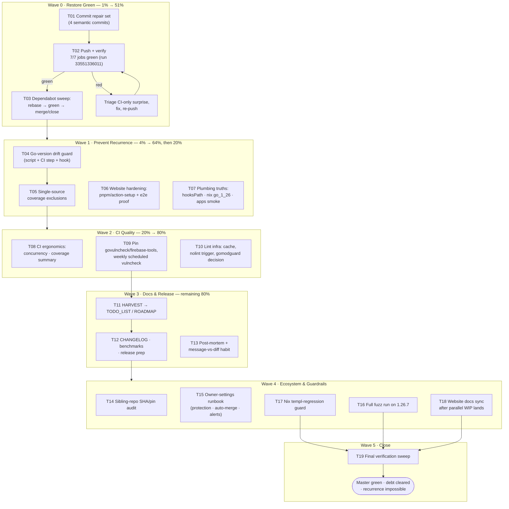

# Pareto Execution Plan — Master CI Green & Permanent Hardening

**Created:** 2026-09-01 21:43 CEST
**Author:** Crush session (glm-5.3-flash)
**Input:** `docs/status/2026-09-01_21-35_github-actions-ci-repair.md` (50 ranked tasks) + live session state
**Goal (definition of done):** master CI 7/7 green, Dependabot debt cleared, every 2026-08 outage class made structurally impossible, docs truthful, release unblocked.
**Risk doctrine (VERSCHLIMMBESSER protection):** every wave is gated on a verified-green state; no change lands without a same-step verification; the repair set itself was already validated locally with CI-equivalent commands (vet / build / test -race / gate 95.2% / govulncheck / actionlint / goreleaser check).

> **Format note:** the pareto-planning skill defaults to a styled HTML report; the user
> explicitly requested `.md` with a mermaid/d2 execution graph — that instruction wins.

---

## 0. Live state at planning time

- Pushed to master just before this plan was written: `2cd47f6..65c213a` (4 semantic commits: ci.yml fix, website.yml fix, go.mod ssetest promotion, flake+docs sync). Status-report commit `3500517` included.
- ~~CI run **33551336011** queued on that push — Wave 0 verification is already in flight.~~ That run hit a transport flake (stale-gen job, proxy.golang.org) and was superseded; **33551718914** is the green verification run (7/7 jobs), after one lint-fix cycle (`cf5f205`).
- ~~Untracked/modified `website/**` + `README.md` belong to a parallel session — **do not touch**.~~ Landed 2026-09-01 as `c249f5d` (website launch overhaul).
- Unanswered owner decisions: Dependabot PR intent (Q2), repo protections (Q3). — still unanswered as of the docs-health session (2026-09-01 late).

## 1. Pareto breakdown

Result = "master green + stays green + repo trust restored".

| Tier              | Share of work | Cumulative result | Contents                                                                                                                                                                                                                                                                                                      |
| ----------------- | ------------- | ----------------- | ------------------------------------------------------------------------------------------------------------------------------------------------------------------------------------------------------------------------------------------------------------------------------------------------------------- |
| **1%**            | 1 action      | **51%**           | **T01+T02: land the verified repair set and watch all 7 CI jobs go green.** One push already in flight. This alone ends the 33-day red-master era, unblocks the Dependabot backlog, and restores the meaning of a green checkmark.                                                                            |
| **4%**            | +2 tasks      | **64%**           | **T03 Dependabot sweep** (clears red-PR debt, ships pending dep/security updates, first real execution of the fixed Website workflow) + **T04 Go-version drift guard** (makes the exact outage class that ate Aug 29 – Sep 1 structurally impossible).                                                        |
| **20%**           | +5 tasks      | **80%**           | **T05** single-source coverage exclusions · **T06** website workflow hardening (pnpm/action-setup + first end-to-end proof) · **T07** repo plumbing truths (hooksPath, nix go_1_26, nix apps smoke) · **T08** CI ergonomics (concurrency, coverage job summary) · **T09** tool pinning + scheduled vulncheck. |
| **Remaining 80%** | +12 tasks     | **100%**          | Lint infra decisions, HARVEST into TODO_LIST/ROADMAP, release prep, post-mortem, sibling-repo audit, owner-settings runbook, fuzz run, nix templ-regression guard, docs sync, final sweep.                                                                                                                    |

The other 20% (the "don't forget" part) is **not optional cleanup** — it is what converts a one-time repair into a system that stays repaired: T10–T19.

## 2. Execution graph

## 3. Level-1 comprehensive plan (30–100 min tasks, ALL todos, impact-sorted)

Covers = item numbers in `docs/status/2026-09-01_21-35_github-actions-ci-repair.md` §f.

| ID  | Wave | Task                                                                                                                                                                                                                      | Min | Impact   | Effort | Customer value                                                                            | Covers                         |
| --- | ---- | ------------------------------------------------------------------------------------------------------------------------------------------------------------------------------------------------------------------------- | --: | -------- | ------ | ----------------------------------------------------------------------------------------- | ------------------------------ |
| T01 | 0    | ~~Commit pending repair set as 4 semantic commits (ci fix / website fix / go.mod tidy / flake+docs)~~ done at `09cc695`, `0cc67b6`, `17db40b`, `65c213a`                                                                  |  40 | Critical | S      | Trustworthy master; every future bisect lands on a green-or-honest commit                 | 1                              |
| T02 | 0    | ~~Push + watch run 33551336011 → require 7/7 green; triage-and-fix any CI-only surprise, re-push~~ done at `cf5f205` (lint fix), verified green as run **33551718914**                                                    |  60 | Critical | M      | CI checkmarks mean something again; releases unblocked                                    | 2                              |
| T03 | 0    | Dependabot sweep: `@dependabot rebase` the 3 website PRs, verify CI **and** Website workflows green on them, merge or close                                                                                               |  45 | High     | S      | Pending dep/security updates ship; red-PR noise gone; Website workflow's first real run   | 3, 9, 38                       |
| T04 | 1    | Go-version drift guard: `scripts/check-go-version.sh` asserting go.mod == ci.yml(×7) == flake GOTOOLCHAIN(×3) == .golangci run.go; wire into CI + pre-commit; self-test by simulating a mismatch                          |  60 | High     | M      | The Aug-29 outage class becomes a 30-second red local hook instead of a 33-day red master | 4, 45                          |
| T05 | 1    | Single-source coverage exclusions: one canonical list file consumed by `scripts/coverage-gate.sh` **and** ci.yml; re-verify 95.2% gate                                                                                    |  45 | High     | S      | Coverage gate can never silently diverge from documented intent again                     | 10, 35                         |
| T06 | 1    | Website hardening: add SHA-pinned `pnpm/action-setup` (reads `packageManager: pnpm@11.20.0`), then run install→astro check→build→html-validate locally end-to-end                                                         |  75 | High     | M      | The workflow that never executed once gets proven before it matters                       | 5, 6, 39                       |
| T07 | 1    | Plumbing truths: inspect `.githooks` (hooksPath mystery), reconcile with `scripts/hooks` + AGENTS.md; `nix eval` locked go_1_26 ≥ 1.26.7; `nix run .#coverage` + `.#auditlog` smoke; note auto-commit-daemon non-behavior |  45 | Medium   | S      | Local dev environment stops contradicting docs; hermetic toolchain confirmed              | 14, 15, 16, 17, 43             |
| T08 | 2    | CI ergonomics: `concurrency` group for ci.yml, step-summary publishing coverage % + per-package table, explicit paths-ignore decision, `workflow_dispatch`                                                                |  60 | Medium   | S      | Faster, more legible CI; coverage visible on every run without clicking logs              | 19, 20, 21, 33                 |
| T09 | 2    | Tool pinning & freshness: pin govulncheck version (document db-freshness tradeoff), pin firebase-tools, add weekly scheduled vulncheck                                                                                    |  60 | Medium   | S      | Security scanning reproducible **and** actually periodic                                  | 11, 36, 44                     |
| T10 | 2    | Lint infra: cache/prebuilt golangci-lint, record the ≥2.13 nolint-cleanup trigger (4 directives), decide gomodguard-vs-convention after depguard removal                                                                  |  75 | Medium   | M      | Lint job faster and future-proof; import-boundary policy explicit                         | 22, 23, 24, 25, 30, 32, 34, 46 |
| T11 | 3    | HARVEST this plan + status report into TODO_LIST.md (actionable) and ROADMAP.md (ideas, incl. GOEXPERIMENT=jsonv2 removal trigger, dependabot grouping)                                                                   |  60 | Medium   | S      | Tasks stop dying in timestamped files; next session starts working, not archaeology       | 27, 31, 40                     |
| T12 | 3    | Release prep: CHANGELOG "Fixed" entries (CI repair, ssetest promotion, gate exclusion), re-baseline BENCHMARKS.md on 1.26.7, draft v0.10.1 notes                                                                          |  90 | Medium   | M      | Next release ships from a green, honestly documented state                                | 24, 26, 28, 49                 |
| T13 | 3    | Post-mortem: outage timeline (runs 30552114311 → 33551336011), two-masking-failures lesson; institutionalize message-vs-diff commit check                                                                                 |  30 | Low      | S      | The process failure (not just the code failure) is recorded where future sessions read    | 29, 42, 50                     |
| T14 | 4    | Sibling-repo audit: grep go-workflow-auditlog / go-sse / go-ndjson (and other sibling websites) for the same SHA-typo + go-version-pin rot patterns; file fixes                                                           |  60 | High     | M      | The typo probably came from somewhere — fix the source, not just the copy                 | 29                             |
| T15 | 4    | Owner-settings runbook: exact clicks/config for required checks, Dependabot auto-merge, master-failure notification; present for approval                                                                                 |  30 | High     | S      | Owner can enable the only protections that prevent silent recurrence                      | 7, 8, 37                       |
| T16 | 4    | Full fuzz sweep on 1.26.7 (8 targets, BuildFlow --max-time 5m or manual batches)                                                                                                                                          |  60 | Medium   | M      | Parser/replay robustness re-proven on the new toolchain                                   | 23                             |
| T17 | 4    | Nix templ-regression guard: reproduce the retracted-v0.9.0 failure mode (vendored source without generated templ), add flake/CI check                                                                                     |  60 | Medium   | M      | The exact regression that forced a retraction can never re-ship                           | 45(status 47)                  |
| T18 | 4    | Website docs sync once parallel WIP lands: contributing.mdx (7 jobs, real govulncheck invocation, Go 1.26.7), README 7-job reality check                                                                                  |  30 | Low      | S      | Public docs stop lying about CI                                                           | 13, 42(status 44)              |
| T19 | 5    | Final verification sweep: run `scripts/hooks/pre-commit` equivalent end-to-end, full gate, git/gh state audit (branches, PRs, runs all green)                                                                             |  30 | Medium   | S      | Explicit "done" with evidence, not vibes                                                  | 47(status 49), 12              |

Totals: 19 tasks, ≈ 16h raw. Waves are gated: W1 starts after T02 is green; W3 after W2; nothing parallelizes across a red state.

## 4. Level-2 breakdown (≤ 12 min per task, ALL todos, impact-sorted)

Done items are marked. Parent = Level-1 task. All times are minutes.

### Wave 0 — Restore green (1% → 51%)

| ID   | Task                                                                                                         | Min | Parent | State                                                                                                                                            |
| ---- | ------------------------------------------------------------------------------------------------------------ | --: | ------ | ------------------------------------------------------------------------------------------------------------------------------------------------ |
| 0.1  | Commit ci.yml fix (Go 1.26.7 ×7, goreleaser v2.17.1, `_templ.go` gate exclusion) with full rationale         |   8 | T01    | ✅ done (09cc695)                                                                                                                                |
| 0.2  | Commit website.yml fix (setup-node v6.5.0 SHA, pnpm-lock cache path)                                         |   5 | T01    | ✅ done (0cc67b6)                                                                                                                                |
| 0.3  | Commit go.mod/go.sum ssetest promotion after double-tidy stability check                                     |   6 | T01    | ✅ done (17db40b)                                                                                                                                |
| 0.4  | Commit flake GOTOOLCHAIN 1.26.7 (×3) + AGENTS/CONTRIBUTING/SKILL doc sync                                    |  10 | T01    | ✅ done (65c213a)                                                                                                                                |
| 0.5  | Push master `2cd47f6..65c213a`; confirm CI run queued (33551336011)                                          |   3 | T01    | ✅ done                                                                                                                                          |
| 0.6  | Watch run: test job (vet, build, race+gate ≥94)                                                              |  12 | T02    | ~~pending~~ ✅ done — run 33551718914, gate 95.2%                                                                                                |
| 0.7  | Watch run: lint job (config verify + v2.12.2 run)                                                            |  10 | T02    | ~~pending~~ ✅ done after lint-fix cycle `cf5f205` (CI flagged 3 of 4 local nolintlint findings; `live/fragments.go:181` confirmed still needed) |
| 0.8  | Watch run: vulncheck, mod-tidy, stale-generation jobs                                                        |  10 | T02    | ~~pending~~ ✅ done — run 33551718914 (after one mod-tidy transport-flake rerun)                                                                 |
| 0.9  | Watch run: actionlint + goreleaser jobs                                                                      |   5 | T02    | ~~pending~~ ✅ done — run 33551718914                                                                                                            |
| 0.10 | If any red: capture step log, fix, re-push, re-watch (loop ≤2×)                                              |  12 | T02    | ~~pending~~ ✅ done — exactly one cycle: `cf5f205`                                                                                               |
| 0.11 | `@dependabot rebase` on astro 7.2.9, starlight 0.41.10, html-validate 11.10.0 PRs                            |   6 | T03    | pending                                                                                                                                          |
| 0.12 | Wait for rebased PR CI; verify each PR's **CI** run green                                                    |  12 | T03    | pending                                                                                                                                          |
| 0.13 | Verify each PR's **Website** run green (first real execution of fixed workflow)                              |  12 | T03    | pending                                                                                                                                          |
| 0.14 | Merge PRs (or close if the parallel website WIP supersedes them — owner Q2); close superseded stale branches |  12 | T03    | pending                                                                                                                                          |

### Wave 1 — Prevent recurrence (4% → 64%)

| ID   | Task                                                                                                                                           | Min | Parent |
| ---- | ---------------------------------------------------------------------------------------------------------------------------------------------- | --: | ------ |
| 1.1  | Write `scripts/check-go-version.sh`: parse go.mod directive, grep ci.yml go-version, flake GOTOOLCHAIN, .golangci run.go; diff and fail loudly |  12 | T04    |
| 1.2  | Self-test guard: temporarily corrupt a copy of go.mod, assert non-zero exit + clear message                                                    |  12 | T04    |
| 1.3  | Wire guard into ci.yml (new step after checkout, before setup-go)                                                                              |   8 | T04    |
| 1.4  | Wire guard into pre-commit hook (`scripts/hooks/pre-commit`) and document in AGENTS.md                                                         |  10 | T04    |
| 1.5  | Extract coverage exclusions to `scripts/coverage-exclusions.txt`; make coverage-gate.sh build grep args from it                                |  12 | T05    |
| 1.6  | Make ci.yml consume the same list (grep -v -f with path-adjusted patterns)                                                                     |  12 | T05    |
| 1.7  | Re-run exact CI test pipeline locally; assert 95.2% GATE_PASS unchanged                                                                        |  12 | T05    |
| 1.8  | Update AGENTS.md gate description (Commands table) to the full exclusion list                                                                  |   8 | T05    |
| 1.9  | Add SHA-pinned `pnpm/action-setup` to website.yml (fetch + API-verify the SHA first)                                                           |  12 | T06    |
| 1.10 | Local `pnpm install --frozen-lockfile` in website/ (non-destructive; node_modules exists)                                                      |  12 | T06    |
| 1.11 | Local `pnpm dlx astro check`                                                                                                                   |  12 | T06    |
| 1.12 | Local `pnpm run build` (astro build + fix-csp)                                                                                                 |  12 | T06    |
| 1.13 | Local html-validate over dist/**/*.html                                                                                                        |  12 | T06    |
| 1.14 | Inspect `.githooks` contents; decide reconcile-vs-document; fix `core.hooksPath` if wrong                                                      |  12 | T07    |
| 1.15 | Update AGENTS.md hook documentation to match reality                                                                                           |   6 | T07    |
| 1.16 | `nix eval` locked nixpkgs `go_1_26.version`; record in flake comment; adjust pin strategy if < 1.26.7                                          |  10 | T07    |
| 1.17 | `nix run .#coverage` end-to-end after GOTOOLCHAIN change                                                                                       |  12 | T07    |
| 1.18 | `nix run .#auditlog -- help` smoke                                                                                                             |   6 | T07    |
| 1.19 | Note auto-commit-daemon non-behavior during session; check daemon config/log if user wants                                                     |   8 | T07    |

### Wave 2 — CI quality (20% → 80%)

| ID   | Task                                                                                                                                        | Min | Parent |
| ---- | ------------------------------------------------------------------------------------------------------------------------------------------- | --: | ------ |
| 2.1  | Add `concurrency: group: ci-${{ github.ref }}, cancel-in-progress` to ci.yml                                                                |   6 | T08    |
| 2.2  | Add step-summary job: render coverage % + per-package table to $GITHUB_STEP_SUMMARY                                                         |  12 | T08    |
| 2.3  | Verify summary renders on a test push                                                                                                       |  10 | T08    |
| 2.4  | Decide + document paths-ignore for website-only PRs (or deliberately keep full CI)                                                          |  12 | T08    |
| 2.5  | Add `workflow_dispatch:` trigger to ci.yml                                                                                                  |   5 | T08    |
| 2.6  | Pin govulncheck: pick version, replace `@latest`, document db-freshness tradeoff in AGENTS.md                                               |  12 | T09    |
| 2.7  | Verify pinned govulncheck runs green locally                                                                                                |  12 | T09    |
| 2.8  | Add `schedule:` weekly cron to ci.yml vulncheck job (or separate workflow)                                                                  |   8 | T09    |
| 2.9  | Pin firebase-tools in deploy job                                                                                                            |  12 | T09    |
| 2.10 | Lint job speed: try GOMODCACHE caching or prebuilt golangci-lint binary; measure delta                                                      |  12 | T10    |
| 2.11 | Record nolint-cleanup trigger (loader.go:50, stream.go:129, live/fragments.go:181, live/server_test.go:684) in TODO_LIST for the ≥2.13 bump |   8 | T10    |
| 2.12 | Decide depguard replacement: re-enable / gomodguard / convention-doc; implement the decision                                                |  12 | T10    |
| 2.13 | Audit lint exclusions cover `_templ.go` consistently with coverage policy                                                                   |   8 | T10    |

### Wave 3 — Docs & release (remaining 80%)

| ID   | Task                                                                                            | Min | Parent |
| ---- | ----------------------------------------------------------------------------------------------- | --: | ------ |
| 3.1  | HARVEST P0/P1 plan items → TODO_LIST.md (with verification steps)                               |  12 | T11    |
| 3.2  | HARVEST P2 items → TODO_LIST.md                                                                 |  12 | T11    |
| 3.3  | Route remaining ideas → ROADMAP.md (jsonv2 removal trigger, dependabot grouping, sibling audit) |  12 | T11    |
| 3.4  | Cross-link status report + this plan from TODO_LIST entries                                     |   6 | T11    |
| 3.5  | CHANGELOG "Fixed": CI repair, ssetest promotion, gate exclusion, website workflow fix           |  12 | T12    |
| 3.6  | Benchmark environment: confirm 1.26.7, run Invocation/Disabled/Registration benchmark batches   |  12 | T12    |
| 3.7  | Run BuildReport + ConcurrentInvocation batches; collect numbers                                 |  12 | T12    |
| 3.8  | Update BENCHMARKS.md table (date, Go 1.26.7, numbers)                                           |  12 | T12    |
| 3.9  | Draft v0.10.1 release notes; verify goreleaser v2.17.1 config + tag plan                        |  12 | T12    |
| 3.10 | Write post-mortem: run-ID timeline 30552114311 → 33551336011, masking-eras lesson               |  12 | T13    |
| 3.11 | Add message-vs-diff commit habit to AGENTS.md (`git show --stat HEAD` before push)              |   8 | T13    |
| 3.12 | Cross-link post-mortem from AGENTS.md toolchain history                                         |   6 | T13    |

### Wave 4 — Ecosystem & guardrails

| ID   | Task                                                                                                       | Min | Parent |
| ---- | ---------------------------------------------------------------------------------------------------------- | --: | ------ |
| 4.1  | Grep go-workflow-auditlog workflows for setup-node/checkout SHA validity + go-version-vs-go.mod mismatches |  12 | T14    |
| 4.2  | Same audit for go-sse, go-ndjson, go-health sibling repos                                                  |  12 | T14    |
| 4.3  | Fix or file issues for each finding (verify-before-filing)                                                 |  12 | T14    |
| 4.4  | Draft branch-protection config (required checks: 7 CI jobs + Website for website paths)                    |  12 | T15    |
| 4.5  | Draft Dependabot auto-merge + rebase config                                                                |   8 | T15    |
| 4.6  | Draft master-failure notification (email/Slack) steps                                                      |  10 | T15    |
| 4.7  | Present runbook to owner for approval (admin-only settings)                                                |   6 | T15    |
| 4.8  | Fuzz batch 1: FuzzPluginHTML, FuzzMigrateReport (30s each)                                                 |  10 | T16    |
| 4.9  | Fuzz batch 2: FuzzDiagramSpecialChars, FuzzFilterInputs                                                    |  10 | T16    |
| 4.10 | Fuzz batch 3: FuzzReadEvents, FuzzMultiWriter                                                              |  10 | T16    |
| 4.11 | Fuzz batch 4: FuzzNDJSONStreamer, FuzzClassifyAdversarialChains; triage any crash                          |  12 | T16    |
| 4.12 | Reproduce retracted-v0.9.0 failure mode locally (vendored source w/o generated templ)                      |  12 | T17    |
| 4.13 | Add flake check or CI step asserting generated files exist before nix build                                |  12 | T17    |
| 4.14 | After parallel WIP lands: update website contributing.mdx (7 jobs, govulncheck invocation, Go 1.26.7)      |  12 | T18    |
| 4.15 | README + STABILITY check against 7-job CI reality                                                          |  10 | T18    |

### Wave 5 — Close

| ID  | Task                                                                                       | Min | Parent |
| --- | ------------------------------------------------------------------------------------------ | --: | ------ |
| 5.1 | Run `scripts/hooks/pre-commit` contents end-to-end (generate drift, vet, lint, test -race) |  12 | T19    |
| 5.2 | Final audit: `gh pr list`, `gh run list`, branch state — everything green, zero stale red  |  10 | T19    |
| 5.3 | Write closing summary with evidence links; mark plan executed                              |   8 | T19    |

Totals: 19 Level-1 tasks / **84 Level-2 tasks**, every status-report item (1–50) mapped, none ≤12min exceeded.

## 5. What was already executed while planning

Per the skill's "commit pending work first" rule and the user's explicit `git commit & git push`: Wave 0 tasks 0.1–0.5 are **done** (commits 09cc695, 0cc67b6, 17db40b, 65c213a pushed; CI run 33551336011 queued). ~~Wave 0 verification (0.6–0.14) continues immediately after this plan is committed.~~ **Execution state (2026-09-01 docs-health):** 0.6–0.10 DONE — run `33551718914` 7/7 green after lint-fix `cf5f205` and one transport-flake rerun; 0.11–0.14 (Dependabot sweep) remain BLOCKED on owner Q1. The launch-overhaul push (`c249f5d`) then gave the fixed Website workflow its first real execution — it failed on missing pnpm; fix written in the working tree (`pnpm/action-setup` v4.1.0, both jobs), verification pending the next `website/**` push.

## 6. Handoff

Section 3/4 = HARVEST input for `TODO_LIST.md` (actionable, Waves 0–2) and `ROADMAP.md` (ideas, Waves 3–4 + jsonv2 trigger + sibling audit). Run `docs-health` → HARVEST; do not let these die in this file.
