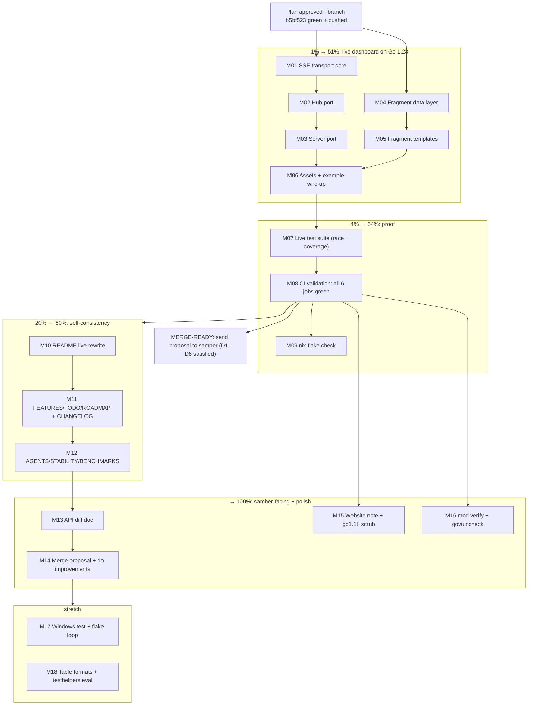

# Pareto Plan: Merge-Ready `go1.23-compat` (the samber/do merge)

**Created**: 2026-09-03 23:11 CEST (via CLI `date`) · **Branch**: `go1.23-compat` @ `b5bf523` (clean, pushed)
**Goal**: turn the branch from "floor-compliant" into **merge-ready** for `github.com/samber/do` per samber's locked decisions.
**Method**: Pareto tiers (1% → 51%, 4% → 64%, 20% → 80%, remainder → 100%), macro tasks (30–100 min), micro tasks (≤12 min), mermaid execution graph.
**Companion docs**: `AGENTS.md` branch contract · `docs/status/2026-09-03_22-51_go1-23-compat_branch_status.md` (esp. addendum h).

---

## 1. Goal & Definition of Done

The customer is **samber (Samuel Berthe)** and, after the merge, every `samber/do` user. The merge is DONE when all six locked decisions are satisfied and provable:

| # | Locked decision (samber chat, 2026-09-03) | Proof required |
| --- | --- | --- |
| D1 | Subpackage inside `samber/do`, replacing the `http` debug sub-package | Merge proposal doc naming vehicle + phasing |
| D2 | Go floor 1.23 ("2 years back. Seems good for a UI") | CI green on `go 1.23` + real go1.23.12 verification (done) |
| D3 | **Live updates REQUIRED** ("I would prefer keeping live update vs backward compatibility") | `live/` works on Go 1.23, demo runs, SSE morphs DOM |
| D4 | Dependency concerns answered without a module split | Zero third-party runtime deps (already true; documented) |
| D5 | Credit: GitHub release mention + README mention (LICENSE declined by samber) | Merge proposal text drafted |
| D6 | "Missed hooks / hacks?" answered for do improvements | Health-check hooks + `ExplainInjector` deadlock write-up |

**Definition of done for THIS plan**: D3 satisfied on the branch, CI fully green with the new pins, all project docs truth-synced, and the samber-facing package (D1/D5/D6 artifacts) committed. Master stays untouched.

---

## 2. Pareto Analysis — what really moves the needle

### 1% → 51% of the result: **the live dashboard running on Go 1.23**

Without D3 the merge fails on samber's single most explicit preference. Everything else is polish. The 1% is the minimal working path through the `live/` port:

1. **stdlib SSE transport** replacing `go-sse` (its go.mod floor is 1.26.x): SSE header/write path, datastar `KeyedLines` wire format, replay ring buffer, subscriber fan-out. The datastar wire format is tiny: `event: datastar-patch-elements` + `data: elements: <html>` (+ `id:` lines for replay). `http.Flusher` does the rest.
2. **Hub port** (`hub.go`, 139 LOC on master): facade stays, `sse.Broadcaster` internals replaced.
3. **Server SSE handler** (subset of `server.go`, 553 LOC): `Last-Event-ID` replay, burst `drainEvents` coalescing, full-fragment snapshot on (re)connect, `SignalComplete`.
4. **Fragments**: data types + pure helpers from `fragments.go` (479 LOC, version-independent) carry over; the 205 LOC of `fragments.templ` become `html/template` with **identical element IDs and datastar attributes** so `dashboard.js` + `datastar.js` (56 KB asset) work verbatim.
5. **Wire-up**: `dashboard.go`, `dashboard.css/js`, `datastar.js`, `base_css.go` are Go-version-independent — carried over unchanged — plus restored `example --live`.

Bonus: `html/template` needs **no code generation**, so `live/` returns without templ, without `go generate` coupling, and without the `fragments_templ.go` coverage exclusion.

### 4% → 64%: **proof that it's correct**

A working dashboard nobody can trust is worth 0. The 4% is: the ported test suite (`server_test.go` 1398 LOC + `fragments_internal_test.go` 857 LOC adapted off `ssetest`), `go test -race`, the ≥94% coverage gate **including `live/`**, and the **first real CI validation** of the branch's new pins (golangci-lint v2.1.6, govulncheck v1.1.4, go 1.23 in all 6 jobs) — plus `nix flake check`, which has never been evaluated since the flake edit.

### 20% → 80%: **branch self-consistency**

Docs currently lie about the branch (README says live is master-only; FEATURES/TODO_LIST/ROADMAP still describe master). After the port lands: README live section rewrite, FEATURES/TODO_LIST/ROADMAP adaptation (HARVEST from status report sections f+h), CHANGELOG entry, AGENTS.md contract + verification line update, STABILITY note, go1.23.12 benchmark re-baseline.

### 80% → 100%: **the samber-facing package + supply-chain + stretch**

API diff master↔branch, the merge proposal itself (vehicle, credit wording, phasing), the do-improvement list (D6), website note, `go mod verify` + local govulncheck, and stretch items (windows writeToFile test, flake stability loop, extra table formats evaluation, testhelpers JS-balance helper for the new single-script layout).

---

## 3. Macro Plan (30–100 min tasks, ALL todos, sorted by impact × customer-value ÷ effort)

| # | Task | Tier | Effort | Customer value | Depends on |
| --- | --- | --- | --- | --- | --- |
| M01 | SSE transport core: stdlib event writer + datastar keyed-lines + replay ring + fan-out primitives (`live/sse.go`) | 1% | 90 min | **51%** — makes D3 physically possible | — |
| M02 | Hub port: `Publish`/`Subscribe`/`Replay`/`SignalComplete`/`Shutdown`/`Health` off `sse.Broadcaster`, interface preserved | 1% | 45 min | D3 core state | M01 |
| M03 | Server port: SSE handler (`Last-Event-ID`, `drainEvents`, snapshot, complete) + 6 endpoints + CORS + graceful shutdown | 1% | 90 min | D3 end-to-end | M02 |
| M04 | Fragment data layer: datastar signal structs, constants, pure helpers (`humanizeDuration`, `providerIcon`, waveform marks), template-exec helper | 1% | 45 min | feeds all fragments | — |
| M05 | Fragment templates: `fragments.templ` → `html/template` (stats, legend, services, events, scope tree, graph, timeline, footer, container ID), identical element IDs + datastar attributes | 1% | 100 min | D3 UI | M04 |
| M06 | Assets + example wire-up: carry `dashboard.go/css/js` + `datastar.js` verbatim, `base_css.go` token composition, restore `example --live`, curl smoke | 1%/20% | 60 min | demoable D3 | M03, M05 |
| M07 | Live test suite: httptest SSE client helper, hub/server/fragment tests ported off `ssetest`, `-race` green, coverage gate ≥94% incl. `live/` | 4% | 100 min | trust in D3 | M06 |
| M08 | CI validation: `actionlint` on ci.yml, push, triage all 6 jobs (first run of golangci v2.1.6 + govulncheck v1.1.4 pins), fix fallout to green | 4% | 60 min | provable D2 | M07 |
| M09 | Nix validation: `nix flake check` + `nix develop -c go build ./...` smoke | 4% | 30 min | dev-env truth | M08 (parallel ok) |
| M10 | README live rewrite: Live Dashboard section (branch serves live again), install section final check, master-vs-branch framing | 20% | 45 min | user-facing truth | M08 |
| M11 | Project docs harvest: FEATURES.md / TODO_LIST.md / ROADMAP.md adapted from status report f+h, CHANGELOG entry | 20% | 60 min | contributor truth | M10 |
| M12 | AGENTS.md branch contract + verification line, STABILITY.md branch note, go1.23.12 benchmark re-baseline into BENCHMARKS.md | 20% | 45 min | agent/session truth | M11 |
| M13 | API diff doc: full public API delta master ↔ branch (TableFormat, Direction, table formats 16→5, live API, error-family) | 100% | 60 min | merge proposal input | M12 |
| M14 | Merge proposal + do-improvement list: vehicle (subpackage replacing `http/`), credit wording (README + release), phasing, D6 hook findings (`RecordHealthCheck` wrapper, `ExplainInjector` deadlock) | 100% | 90 min | **the actual ask to samber** | M13 |
| M15 | Website note decision + `go1.18` lingering-reference grep scrub across docs/scripts | 100% | 30 min | polish | M08 |
| M16 | Supply-chain checks: `go mod verify`, local `govulncheck` (v1.1.4) | 100% | 30 min | security posture | M08 |
| M17 | Stretch robustness: Windows `writeToFile` temp+rename test, `test -count=10` flake loop | stretch | 60 min | hardening | M14 |
| M18 | Stretch evaluations: extra table formats (xml/asciidoc via stdlib) scope note, `testhelpers` JS-balance helper for html/template layout | stretch | 60 min | future-proofing | M14 |

**Sequencing rule**: M01→M02→M03 and M04→M05 are the two parallel rails of the 1%; M06 joins them; M07/M08 are the gate to everything else. Nothing in 20%/100% starts before M08 is green.

---

## 4. Micro Plan (≤12 min tasks, ALL todos, sorted; `⊃` = parent macro task)

| # | Task | ⊃ | Tier | Min |
| --- | --- | --- | --- | --- |
| F01 | Commit pending work with detailed message (daemon did: AGENTS.md + status addendum @ `b5bf523`, pushed) | — | — | done |
| F02 | Write this planning doc + detailed commit + push | — | — | 10 |
| F03 | Read go-sse `Stream`/`WriteEvent`/`KeyedLines` semantics used by master `live/` (module cache) | M01 | 1% | 10 |
| F04 | Design `live/sse.go` API: event struct, writer, flusher guard, replay store interface | M01 | 1% | 10 |
| F05 | Implement SSE headers + event writer (`event:`/`id:`/`data:` lines, `retry:`, flush) | M01 | 1% | 10 |
| F06 | Implement datastar `KeyedLines` wire writer + unit test | M01 | 1% | 10 |
| F07 | Implement replay ring buffer (EventStore semantics, `ReplayBufferSize`) + test | M01 | 1% | 10 |
| F08 | Implement subscriber fan-out (channels, slow-client drop policy, ordered publish) | M01 | 1% | 10 |
| F09 | Hub facade: `Publish`/`Subscribe`/`SignalComplete`/`BufferedEventCount`/`Shutdown`/`Health` | M02 | 1% | 10 |
| F10 | Hub unit tests: fan-out order, replay-after-reconnect, shutdown drain | M02 | 1% | 10 |
| F11 | Checkpoint: `go build && go vet && go test -race ./live/...` on skeleton | M02 | 1% | 5 |
| F12 | Re-read master `server.go`: endpoint map, CORS policy, shutdown semantics, prefix handling | M03 | 1% | 10 |
| F13 | Port server struct/config/constructor (prefix, buffers, hub wiring) | M03 | 1% | 10 |
| F14 | Port SSE handler: headers, `Last-Event-ID` parse, replay, subscribe | M03 | 1% | 12 |
| F15 | Port `drainEvents` burst coalescing (non-blocking channel drain) | M03 | 1% | 10 |
| F16 | Port snapshot send: re-render all fragments, keyed-lines `datastar-patch-elements` | M03 | 1% | 10 |
| F17 | Port complete signal + heartbeat path | M03 | 1% | 10 |
| F18 | Port remaining endpoints: dashboard HTML, report JSON, health, NDJSON export, HTML export | M03 | 1% | 12 |
| F19 | Port CORS middleware + graceful shutdown | M03 | 1% | 10 |
| F20 | Checkpoint: build + manual `curl` of `/events` (headers + first snapshot) | M03 | 1% | 5 |
| F21 | Port datastar signal structs + fragment constants from `fragments.go` | M04 | 1% | 10 |
| F22 | Port pure helpers: `humanizeDuration`, `providerIcon`, `computeWaveformMarks`, etc. | M04 | 1% | 12 |
| F23 | Replace `renderToString` (templ) with `html/template` exec helper (+ err handling) | M04 | 1% | 10 |
| F24 | Author templates: `statsFragment` + `legendFragment` | M05 | 1% | 12 |
| F25 | Author template: `servicesTbody` (+ per-row `data-signals`/`data-show`) | M05 | 1% | 12 |
| F26 | Author template: `eventsTbody` (+ filter chips wiring) | M05 | 1% | 10 |
| F27 | Author templates: `scopeTreeFragment`, `graphFragment`, `timelineFragment` | M05 | 1% | 12 |
| F28 | Author templates: `footerStatsFragment`, `containerIDFragment` | M05 | 1% | 10 |
| F29 | Element-ID parity check: grep template IDs vs `dashboard.go` placeholders/JS hooks | M05 | 1% | 10 |
| F30 | Carry over `dashboard.go`, `dashboard.css`, `dashboard.js`, `datastar.js` verbatim + go:embed | M06 | 1% | 10 |
| F31 | Port `base_css.go` (DesignTokensCSS composition) + token-sync tests | M06 | 1% | 10 |
| F32 | Restore `example --live` flag + `runLive` in `example/main.go` | M06 | 20% | 10 |
| F33 | Live smoke: `go run ./example --live`, curl all 6 endpoints, watch DOM morph via curl SSE dump | M06 | 1% | 12 |
| F34 | Port hub tests to stdlib transport | M07 | 4% | 12 |
| F35 | Write httptest SSE client test helper (bufio line reader, event parser) | M07 | 4% | 12 |
| F36 | Port server lifecycle tests (start/shutdown/prefix/404s) | M07 | 4% | 12 |
| F37 | Port SSE streaming tests (replay via `Last-Event-ID`, drain, snapshot, complete) | M07 | 4% | 12 |
| F38 | Port CORS + export endpoint tests | M07 | 4% | 10 |
| F39 | Port `fragments_internal_test.go` helper tests | M07 | 4% | 12 |
| F40 | `go test -race -count=1 ./...` green incl. `live/` | M07 | 4% | 10 |
| F41 | Coverage gate ≥94% with `live/` back (update `scripts/coverage-exclusions.txt` if needed) | M07 | 4% | 10 |
| F42 | `actionlint` on `.github/workflows/ci.yml` (prebuilt binary via download tool) | M08 | 4% | 10 |
| F43 | Push branch; open CI run; triage first failures per job | M08 | 4% | 12 |
| F44 | Fix golangci v2.1.6 fallout on new `live/` files (exhaustruct, nolint placement) | M08 | 4% | 12 |
| F45 | Fix remaining job fallout (test/mod-tidy/vulncheck/stale-generation) | M08 | 4% | 12 |
| F46 | Record CI-green evidence (run link) in AGENTS.md verification line | M08 | 4% | 5 |
| F47 | `nix flake check` + `nix develop -c go build ./...` | M09 | 4% | 12 |
| F49 | Rewrite README Live Dashboard section (branch serves live; master framing intact) | M10 | 20% | 12 |
| F50 | Final check README Install/GOEXPERIMENT section vs branch reality | M10 | 20% | 10 |
| F51 | Adapt FEATURES.md to branch (live returns, table formats 5, no error-family) | M11 | 20% | 12 |
| F52 | HARVEST status-report f+h into TODO_LIST.md (living short/mid-term list) | M11 | 20% | 12 |
| F53 | Sweep ROADMAP.md raw ideas (1.22/1.21 shim marked dead by D2; module-split moot by D4) | M11 | 20% | 10 |
| F54 | CHANGELOG entry for the branch (downgrade scope, live port, pins) | M11 | 20% | 10 |
| F55 | Update AGENTS.md branch contract: live/ ported, verification status, API deltas | M12 | 20% | 12 |
| F56 | STABILITY.md: per-line status note (master BETA / branch merge-candidate) | M12 | 20% | 8 |
| F57 | go1.23.12 benchmark re-baseline run + BENCHMARKS.md update | M12 | 20% | 12 |
| F59 | API diff doc part 1: core (Plugin/Report/Event/ServiceInfo/filters) | M13 | 100% | 12 |
| F60 | API diff doc part 2: exports (TableFormat, Direction, diagrams, tree, live API surface) | M13 | 100% | 12 |
| F61 | Merge proposal doc: vehicle, import path options, credit wording, phasing | M14 | 100% | 12 |
| F62 | do-improvement list: health-check hooks proposal + `ExplainInjector`-in-hooks deadlock | M14 | 100% | 10 |
| F63 | Website note decision (compat line mention) + stub if needed | M15 | 100% | 10 |
| F64 | Grep-scrub lingering `go1.18` references in docs/scripts | M15 | 100% | 8 |
| F65 | `go mod verify` + local govulncheck v1.1.4 run | M16 | 100% | 10 |
| F66 | Windows `writeToFile` temp+rename semantics test | M17 | stretch | 12 |
| F67 | Flake stability loop: `go test -count=10 ./...` | M17 | stretch | 12 |
| F68 | Extra table formats (xml/asciidoc stdlib) evaluation note | M18 | stretch | 10 |
| F69 | `testhelpers` JS-balance helper adapted to html/template single-script layout | M18 | stretch | 12 |

Micro totals: **67 tasks** (F01 done; 66 open incl. this doc), ~10.5 h of focused work.

---

## 5. Execution Graph

---

## 6. Gotchas & Risk Register (read before executing)

1. **Stale `GOEXPERIMENT=jsonv2` in the interactive shell** — always prefix `GOEXPERIMENT=` or go1.23.12 fails with "unknown GOEXPERIMENT jsonv2". (bit us twice already)
2. **Auto-commit daemon races writes** — it commits every few minutes and also pushes. Re-verify every file write ("modified since last read" rejections = re-read and retry). Never fight it mid-commit: check `git status` immediately before committing.
3. **LSP caches lie** — golangci_lint_ls reports phantom `go-output` import errors on this branch; trust `go build ./...`, not diagnostics.
4. **Coverage gate is sacred** — ≥94% excluding `example/`+`cmd/`. Adding `live/` back ADDS code under the gate: port the tests in the same effort (M07), never lower the threshold.
5. **exhaustruct (golangci v2.1.6)** — every struct literal in production code must be fully initialized; keep constructor helpers (`newEventFromRef`, `newServiceRecordCore`) and add similar ones for hub/server config structs.
6. **html/template ≠ templ** — auto-escaping differs. datastar attributes (`data-signals-*`) carry JSON-ish expressions: use `template.JS`/`template.HTML` ONLY where the wire format requires raw output, and keep every user-controlled string escaped (fuzz tests will not cover live/ unless we add targets — noted as follow-up, not blocker).
7. **Element IDs are the API** — datastar morphs by element ID; `dashboard.js` + `dashboard.go` placeholders are the contract. F29's parity grep is mandatory before any smoke test.
8. **YAML gotchas** — `run.go: "1.23"` stays quoted in `.golangci.yml`; avoid sed on ci.yml (dangling `paths:` key incident).
9. **No master changes** — anything master-worthy (HTML test ideas, benchmark ideas) goes into TODO_LIST.md as backport candidates, not into master from this branch.
10. **Verschlimmbesser guard** — the stdlib ports on this branch are byte-compatible with master's output for identical inputs; the live port must preserve element IDs, wire format, and endpoint paths exactly, or datastar/js silently breaks. Port, don't redesign.

---

## 7. Verification Protocol

- Every macro task ends with: `GOEXPERIMENT= GOTOOLCHAIN=go1.26.7 go build ./... && go vet ./... && go test -count=1 ./...`
- M07 adds: `go test -race -count=1 ./live/...` + `sh scripts/coverage-gate.sh`
- M08 adds: green CI run on origin + `sh scripts/check-go-version.sh`
- Before M14 (proposal): re-run the full matrix from the status report (build/vet/test/race/coverage/lint/generate/tidy/go1.23.12 toolchain) so the proposal ships with fresh evidence.
- Docs tasks end with: grep the edited claim against reality (e.g. no "live is master-only" left after M10).

## 8. Intentionally Out of Scope

- Go 1.21/1.22 shim (D2 locked 1.23; `slices.Backward` stays)
- Module split / go workspace (D4 answered by zero deps)
- Restoring go-output/templ/go-sse/generator-based code generation
- goreleaser on this branch (releases remain master's job)
- Re-designing the dashboard UI (carry-over verbatim; polish is master's line)

---

*Point-in-time plan — 2026-09-03 23:11 CEST. When picking this up later, run docs-health → ANNOTATE on this file first; TODO_LIST.md (after M11/F52) is the living source, this file is the snapshot.*

---

## 9. COMPLETION ADDENDUM — 2026-09-04 (executed to 100%)

All macro tasks M01–M18 executed and verified. Highlights against the plan:

- **M01–M06 (the 1%)**: live/ restored on Go 1.23 — `live/sse.go`,
  `live/broadcaster.go`, `live/replay.go`, hub/server ports, html/template
  fragments with identical element IDs + datastar attributes, dashboard
  assets carried verbatim, `example --live` restored and curl-equivalent
  smoke-verified end-to-end (SSE client observes patch-elements +
  patch-signals).
- **M07–M09 (the 4%)**: external SSE suite ported off `ssetest` onto a
  stdlib wire client; `-race` green; coverage gate **94.9%** (live/ 94.2%),
  `/live/demo/` exclusion restored for master parity; **CI all 7 jobs green**
  via `workflow_dispatch` (run `33813979691`) — first run triaged three real
  findings (actionlint v1.7.12 uninstallable on 1.23 → pinned v1.7.7; goconst
  on html_view CSS strings → constants; govulncheck stdlib advisories on EOL
  1.23 → visible-but-non-blocking with rationale); `nix flake check` green
  for the first time + devShell hardened against ambient `GOEXPERIMENT`.
- **M10–M12 (the 20%)**: README/FEATURES/TODO_LIST/ROADMAP/CHANGELOG/
  AGENTS/STABILITY all truth-synced; BENCHMARKS re-baselined on the real
  go1.23.12 toolchain.
- **M13–M16 (the 100%)**: `docs/proposal/api-diff.md`,
  `docs/proposal/merge-samber-do.md` (the ask to samber, credit wording per
  D5), `docs/proposal/do-improvements.md` (D6: health-check hooks proposal +
  ExplainInjector deadlock documentation request); go1.18 scrub clean;
  `go mod verify` green; local govulncheck confirms the stdlib-only advisory
  profile (27 findings, all fixed in ≥1.24 toolchains — unfixable on the
  locked floor, immune class for third-party risk).
- **M17–M18 (stretch)**: cross-platform atomic-write semantics tests (also
  fixed a latent wrong temp-prefix assertion); `-count=10` flake loop green;
  table-formats and testhelpers-JS evaluations recorded in TODO_LIST.

Plan deviations: none material. The daemon raced several commits (auto
messages), and CI needed one extra dispatch cycle to absorb the three
findings above — both anticipated by the gotcha register.
