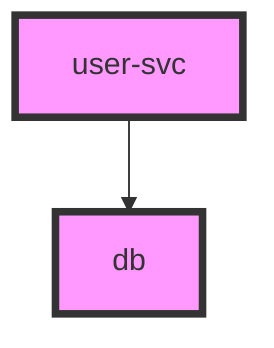

# Adoption Review: `github.com/larsartmann/go-output`

**Date:** 2026-06-17
**Question:** Should `samber-do-auditlog` adopt `go-output/...` for its export pipeline?
**Reviewer verdict:** **Do NOT adopt wholesale. Adopt the escaping *concept* locally (no dependency).**

---

## TL;DR

| Candidate adoption | Verdict | Why |
| ------------------ | ------- | --- |
| Replace Mermaid export with `go-output/graph` | **NO** | Breaking output format (markdown-fenced, pink theme, no warm-amber directive), loses edge dedup, +11 external modules for ~60 LOC saved |
| Replace PlantUML export with `go-output/plantuml` | **NO** | Same regression class; different skinparam; no dedup |
| Replace JSON/NDJSON with `go-output/serialization` | **NO** | `encoding/json` is already optimal; serialization drags in `go-faster/yaml` + `go-toml/v2` transitively |
| Add new formats (DOT, D2, CSV, YAML) | **DEFER** | Real capabilities but dep cost disproportionate for a deliberately lean single-package plugin |
| Fix the diagram **escaping bug** exposed by this review | **YES — locally** | Confirmed malformed output today; fix with a few inline lines, zero new dependencies |

---

## 1. What `go-output` is

A 16-format output library (tables, trees, diagrams) with type-safe enums, branded IDs, and a `Renderer`/`GraphRenderer` interface hierarchy. Multi-module workspace; each sub-module is independently versioned (`v0.11.0`, pre-v1). Relevant modules to this review:

- `graph/` — Mermaid + DOT renderers (`output.GraphRenderer`)
- `plantuml/` — PlantUML renderer (`output.GraphRenderer`)
- `serialization/` — JSON, YAML, TOML, JSONL
- `escape/` — format-specific string escaping (zero deps)
- root — Markdown, Tree, `TableData`, `GraphNode`/`GraphEdge`

## 2. What `samber-do-auditlog` exports today

- **Mermaid + PlantUML** — `diagram.go` (150 LOC): a `diagramFormatter` interface + `writeDiagram()` that deduplicates nodes/edges, sorts for determinism, and batches into a single `Write`. Two formatters carry an **intentional warm-amber theme** (Mermaid `%%{init}%%` directive, PlantUML `skinparam`) that matches the HTML visualization aesthetic.
- **JSON / NDJSON** — `report.go` + `export.go`: stdlib `encoding/json`. Minimal and correct.
- **HTML** — `html.templ`: a rich, interactive, self-contained 5-tab visualization. Not comparable to `go-output/markup` HTML (plain tables).

External dependencies today: **only `samber/do/v2` and `a-h/templ`**. `depguard` enforces this allow-list.

## 3. Evidence: output format is NOT compatible

Same dependency graph (`user-svc → db`) rendered by both:

**Current auditlog Mermaid:**
```
%%{init: {'theme':'base', 'themeVariables': {'primaryColor':'#e8a838', ...}}}%%
flowchart TD
    <scopeid>_db[db 😴]
    <scopeid>_user_svc[user-svc 😴]
    <scopeid>_user_svc --> <scopeid>_db
```

**`go-output/graph` MermaidRenderer:**
````

````

Differences that make a swap a **breaking change**:
1. Markdown code fence (` ```mermaid `) vs raw flowchart.
2. **Pink** `classDef` (`#f9f`) vs the warm-amber `%%{init}%%` theme — a deliberate design-coherence regression (see AGENTS.md "Diagram themes").
3. No provider-type icons (😴/⚡) in labels.
4. **No edge deduplication** — `go-output` renders every edge added; auditlog's `writeDiagram` deduplicates (covered by `TestWriteMermaid_DuplicateEdges`). The dedup logic would have to stay, so little code is actually deleted.

## 4. Evidence: dependency cost

| Option | External modules added | Notable dragged-in deps |
| ------ | ---------------------- | ----------------------- |
| `graph` + `plantuml` | **11** + 6 larsartmann submodules | `go-faster/yaml`, `go-toml/v2`, `segmentio/asm`, `go.uber.org/multierr`, `davecgh/go-spew`, `golang.org/x/exp` |
| `serialization` (JSON/NDJSON) | **7**+ | `go-faster/yaml`, `go-toml/v2`, `jx` |
| `escape` only | **0** | none |

Measured via `go list -m all` on a scratch module. The graph module transitively pulls the root module, whose `go.mod` requires `serialization`/`delimited` — so even a "diagram-only" adoption bloats the module graph with YAML/TOML libraries the plugin never uses.

For a plugin whose entire value proposition is *minimal-overhead DI observability*, adding 11 modules to render formats it already has is disproportionate.

## 5. Evidence: a real bug this review surfaced

Service name containing `]"` (e.g. a misconfigured named service) produces **malformed Mermaid today**:

```
root_evil]"svc[evil]"svc]
```

`diagramNodeID` and `NodeDecl` perform no label/ID escaping beyond `- / . → _`. Brackets, braces, and quotes leak straight through, breaking the `id[label]` syntax. PlantUML has the same class of bug (label sits inside `"..."` with no quote escaping).

`go-output`'s `escape.MermaidText` / `escape.MermaidID` solve this correctly (`evil]"svc` → label `evil)'svc`, valid ID). **This is the one genuinely valuable takeaway** — but the fix is ~10 lines and needs no dependency.

## 6. Recommendation

1. **Do not adopt `go-output` modules.** The cost/benefit is net-negative: breaking output, lost theming, dep bloat, negligible LOC savings, and coupling to another pre-v1 module.
2. **Do fix the escaping bug locally** — mirror `go-output`'s validated escaping (Mermaid label + ID sanitization, PlantUML label escaping) inline in `diagram.go`. Zero new dependencies, keeps the lean surface area, closes a real correctness gap.
3. **Revisit "add new formats" (DOT, CSV)** only if format breadth becomes an explicit user priority, and even then prefer a thin local renderer over importing the graph module.

## 7. Decision log

- **2026-06-17:** Reviewed against `go-output` v0.11.0. Declined wholesale adoption; approved local escaping hardening. See `diagram.go` escaping fix + tests.
