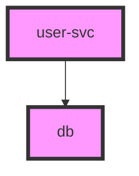

# Adoption Review: `github.com/larsartmann/go-output`

**Date:** 2026-06-17
**Question:** Should `samber-do-auditlog` adopt `go-output/...` for its export pipeline?
**Reviewer verdict:** ~~Do NOT adopt wholesale.~~ **Viable for adoption (v0.12.0+).** Adopt when a 3rd diagram format is needed. See §8 Addendum.

---

## TL;DR

| Candidate adoption                                      | Verdict           | Why                                                                                                                                     |
| ------------------------------------------------------- | ----------------- | --------------------------------------------------------------------------------------------------------------------------------------- |
| Replace Mermaid export with `go-output/graph`           | **NO**            | Breaking output format (markdown-fenced, pink theme, no warm-amber directive), loses edge dedup, +11 external modules for ~60 LOC saved |
| Replace PlantUML export with `go-output/plantuml`       | **NO**            | Same regression class; different skinparam; no dedup                                                                                    |
| Replace JSON/NDJSON with `go-output/serialization`      | **NO**            | `encoding/json` is already optimal; serialization drags in `go-faster/yaml` + `go-toml/v2` transitively                                 |
| Add new formats (DOT, D2, CSV, YAML)                    | **DEFER**         | Real capabilities but dep cost disproportionate for a deliberately lean single-package plugin                                           |
| Fix the diagram **escaping bug** exposed by this review | **YES — locally** | Confirmed malformed output today; fix with a few inline lines, zero new dependencies                                                    |

---

## 1. What `go-output` is

A 16-format output library (tables, trees, diagrams) with type-safe enums, branded IDs, and a `Renderer`/`GraphRenderer` interface hierarchy. Multi-module workspace; each sub-module is independently versioned (`v0.11.0`, pre-v1). Relevant modules to this review:

- `graph/` — Mermaid + DOT renderers (`output.GraphRenderer`)
- `plantuml/` — PlantUML renderer (`output.GraphRenderer`)
- `serialization/` — JSON, YAML, TOML, JSONL
- `escape/` — format-specific string escaping (zero deps)
- root — Markdown, Tree, `TableData`, `GraphNode`/`GraphEdge`

## 2. What `samber-do-auditlog` exports today

- **Mermaid + PlantUML** — `diagram.go` (150 LOC): a `diagramFormatter` interface + `writeDiagram()` that deduplicates nodes/edges, sorts for determinism, and batches into a single `Write`. Two formatters carry an **intentional warm-amber theme** (Mermaid `%%{init}%%` directive, PlantUML `skinparam`) that matches the HTML visualization aesthetic.
- **JSON / NDJSON** — `report.go` + `export.go`: stdlib `encoding/json`. Minimal and correct.
- **HTML** — `html.templ`: a rich, interactive, self-contained 5-tab visualization. Not comparable to `go-output/markup` HTML (plain tables).

External dependencies today: **only `samber/do/v2` and `a-h/templ`**. `depguard` enforces this allow-list.

## 3. Evidence: output format is NOT compatible

Same dependency graph (`user-svc → db`) rendered by both:

**Current auditlog Mermaid:**

```
%%{init: {'theme':'base', 'themeVariables': {'primaryColor':'#e8a838', ...}}}%%
flowchart TD
    <scopeid>_db[db 😴]
    <scopeid>_user_svc[user-svc 😴]
    <scopeid>_user_svc --> <scopeid>_db
```

**`go-output/graph` MermaidRenderer:**

````

````

Differences that make a swap a **breaking change**:

1. Markdown code fence (` ```mermaid `) vs raw flowchart.
2. **Pink** `classDef` (`#f9f`) vs the warm-amber `%%{init}%%` theme — a deliberate design-coherence regression (see AGENTS.md "Diagram themes").
3. No provider-type icons (😴/⚡) in labels.
4. **No edge deduplication** — `go-output` renders every edge added; auditlog's `writeDiagram` deduplicates (covered by `TestWriteMermaid_DuplicateEdges`). The dedup logic would have to stay, so little code is actually deleted.

## 4. Evidence: dependency cost

| Option                        | External modules added            | Notable dragged-in deps                                                                                        |
| ----------------------------- | --------------------------------- | -------------------------------------------------------------------------------------------------------------- |
| `graph` + `plantuml`          | **11** + 6 larsartmann submodules | `go-faster/yaml`, `go-toml/v2`, `segmentio/asm`, `go.uber.org/multierr`, `davecgh/go-spew`, `golang.org/x/exp` |
| `serialization` (JSON/NDJSON) | **7**+                            | `go-faster/yaml`, `go-toml/v2`, `jx`                                                                           |
| `escape` only                 | **0**                             | none                                                                                                           |

Measured via `go list -m all` on a scratch module. The graph module transitively pulls the root module, whose `go.mod` requires `serialization`/`delimited` — so even a "diagram-only" adoption bloats the module graph with YAML/TOML libraries the plugin never uses.

For a plugin whose entire value proposition is _minimal-overhead DI observability_, adding 11 modules to render formats it already has is disproportionate.

## 5. Evidence: a real bug this review surfaced

Service name containing `]"` (e.g. a misconfigured named service) produces **malformed Mermaid today**:

```
root_evil]"svc[evil]"svc]
```

`diagramNodeID` and `NodeDecl` perform no label/ID escaping beyond `- / . → _`. Brackets, braces, and quotes leak straight through, breaking the `id[label]` syntax. PlantUML has the same class of bug (label sits inside `"..."` with no quote escaping).

`go-output`'s `escape.MermaidText` / `escape.MermaidID` solve this correctly (`evil]"svc` → label `evil)'svc`, valid ID). **This is the one genuinely valuable takeaway** — but the fix is ~10 lines and needs no dependency.

## 6. Recommendation

1. **Do not adopt `go-output` modules.** The cost/benefit is net-negative: breaking output, lost theming, dep bloat, negligible LOC savings, and coupling to another pre-v1 module.
2. **Do fix the escaping bug locally** — mirror `go-output`'s validated escaping (Mermaid label + ID sanitization, PlantUML label escaping) inline in `diagram.go`. Zero new dependencies, keeps the lean surface area, closes a real correctness gap.
3. **Revisit "add new formats" (DOT, CSV)** only if format breadth becomes an explicit user priority, and even then prefer a thin local renderer over importing the graph module.

## 7. Decision log

- **2026-06-17 (initial):** Reviewed against `go-output` v0.11.0. Declined wholesale adoption; approved local escaping hardening. See `diagram.go` escaping fix + tests.
- **2026-06-17 (re-evaluation):** go-output v0.12.0 resolved all 4 critical blockers. Verdict updated to **viable for adoption**. See Addendum below.

---

## 8. Addendum: Re-evaluation after go-output v0.12.0

**Date:** 2026-06-17
**Trigger:** go-output maintainer responded to all 8 feedback items (see `go-output/docs/feedback/2026-06-17_..._APPENDIX.md`). go-output tagged v0.12.0 at commit `021c333`.

### Verification: all claims confirmed against source

Every fix was verified by reading the committed source code, not just the appendix claims:

| #   | Issue                     | Claim                                                                                                | Verified                                                        |
| --- | ------------------------- | ---------------------------------------------------------------------------------------------------- | --------------------------------------------------------------- |
| C1  | GraphStyle ignored        | Mermaid emits per-node `style <id> fill:...,stroke:...`; PlantUML emits inline `#[fill;line:stroke]` | ✅ `graph/mermaid.go:120-151`, `plantuml/plantuml.go:57,91-107` |
| C2  | No edge dedup             | `DedupEdges()` method on `GraphRendererState`, opt-in                                                | ✅ `graph.go:157-181`                                           |
| C3  | Markdown fence locked     | `SetCodeFence(bool)` on `MermaidRenderer`, default `true`                                            | ✅ `graph/mermaid.go:42-60`                                     |
| C4  | Root pulls YAML/TOML      | `serialization` removed from root `go.mod` `require` block                                           | ✅ `go.mod` — only in `replace` (local dev)                     |
| I5  | SlugifyID gaps            | Now replaces `. * [ ] { } ( )` in addition to `␣ - /`                                                | ✅ `escape/escape.go:70-81`                                     |
| I6  | Hardcoded DOT attrs       | `SetRankDir(RankDir)`, `SetSplines(SplineStyle)`, `SetNodeSep`, `SetRankSep` + typed enums           | ✅ `graph/dot.go:44-98`, `graph/dot_enum.go`                    |
| I7  | No io.Writer for diagrams | Already supported via `StreamingRendererFromRenderer()` adapter                                      | ✅ `streaming.go:24`                                            |
| N8  | No stability promise      | ADR 006 documents stable vs experimental tiers                                                       | ✅ `docs/adr/006-api-stability.md`                              |

### Dependency tree re-measured

```
BEFORE (v0.11.0): 11 unwanted external modules (go-faster/yaml, go-toml/v2, segmentio/asm, ...)
AFTER  (v0.12.0):  2 modules (golang.org/x/sys, golang.org/x/term)
```

Measured via `go list -m all` on a scratch module importing only `graph` + `plantuml`. The remaining 2 are standard Go supplementary libraries present in nearly every Go project.

### Updated verdict

**The adoption is now technically viable.** All 4 critical blockers are resolved, the dependency surface is clean, and the API has the right escape hatches (`SetCodeFence`, `GraphStyle`, `DedupEdges`, typed enums).

**Recommendation: adopt when the project needs a 3rd diagram format (e.g. DOT).**

The local `diagram.go` (~200 LOC) is working, tested, and the escaping bug is already fixed locally. Adopting go-output now would replace working code with a dependency for no net new capability. The trigger to adopt is **format breadth**: when the project adds DOT, CSV, or D2 export, go-output becomes the clear choice over hand-rolling each renderer.

When that trigger fires, the integration path is straightforward:

```go
// ~15 lines replaces the entire diagramFormatter + writeDiagram machinery
r := graph.NewMermaidRenderer()
r.SetCodeFence(false)
// Set GraphStyle.FillColor/StrokeColor for warm-amber theme per node
// AddNode / AddEdge / DedupEdges / Render
```

---

## 9. Adoption executed

**Date:** 2026-06-21
**Trigger:** DOT (the 3rd diagram format) had been hand-rolled locally, firing the §8 adoption condition. User directed adoption. D2 (4th format) added same day as a natural extension of the go-output pipeline.
**Versions adopted:** `go-output` root `v0.17.0`, `graph`/`plantuml`/`escape`/`d2` `v0.13.0` (latest published tags).

### What changed

- **Deleted** (~237 LOC): the `diagramFormatter` interface, `writeDiagram`, the three formatter structs (`mermaidFormatter`/`plantumlFormatter`/`dotFormatter`), and the local escaping helpers (`sanitizeDiagramID`, `isDiagramIdentRune`, `diagramIDReplacer`, `mermaidLabel`/`mermaidLabelReplacer`, `plantumlLabel`, `dotLabel`/`dotLabelReplacer`).
- **Added** (~150 LOC): `diagram.go` now builds `[]output.GraphNode` / `[]output.GraphEdge` (`buildDiagramNodes` with first-wins node dedup; `buildDiagramEdges`), applies `warmAmberNodeStyle` per node, and renders via `writeRendered`. Each `Write*` method is ~12 lines: construct the go-output renderer → configure → `SetNodes`/`SetEdges`/`DedupEdges` → `writeRendered`. D2 uses a `dedupGraphEdges` helper since `d2.D2Diagram` lacks built-in `DedupEdges()`.
- Escaping now delegates to go-output's `escape` package (`SlugifyID`+`MermaidID` for IDs; `MermaidText`/`PlantUML`/`DOT` for labels). Verified byte-identical to the local helpers for the Mermaid case; PlantUML/DOT use go-output's (more correct) escaping.

### Dependency cost (re-measured, final)

| Metric                                              | Value                                                        |
| --------------------------------------------------- | ------------------------------------------------------------ |
| Net new **external** compiled module                | **1** (`golang.org/x/term`; `x/sys` already present)         |
| New `larsartmann` compiled modules                  | `go-output` (root) + `escape` + `graph` + `plantuml` + `d2` + `enum` + `envdetect` + `go-branded-id` (all same author; branded-id is zero-dep phantom types) |
| `delimited`/`markdown`/`tree`/`testhelpers`/`graphtest` | Module-graph verification entries only — **zero packages compiled** (confirmed via `go list -deps`). Root's core invariant (zero sub-module imports) holds. |

### Output-format changes (documented; project is ALPHA)

| Format   | Before                                              | After (go-output)                                                                                   | Net                                  |
| -------- | --------------------------------------------------- | --------------------------------------------------------------------------------------------------- | ------------------------------------ |
| Mermaid  | `%%{init}%%` global theme + `id[label]` + `-->`     | per-node `style <id> fill/stroke/color` + `id[label]` + `-->`                                       | Theming mechanism changes; output stays valid Mermaid |
| PlantUML | `component "label" as id` (skinparam block)         | `[label] as id #color;line:...;text:...` (skinparam componentStyle uml2)                            | Bracket notation; `\]`/`\"` escaping (more correct) |
| DOT      | `digraph do_auditlog { bgcolor="#14110d" ... }`     | `digraph do_auditlog { rankdir=LR ... }` per-node `fillcolor`/`color`                               | Dark `bgcolor` + edge color dropped (renderers lack graph-attr setter) |
| D2       | N/A (new format)                                    | `id: label { style.fill:... }` + `id -> id`                                                        | New format; zero breaking changes to existing outputs |

### Tradeoffs accepted

1. **DOT dark background lost** — go-output's `DOTRenderer` has no graph-level `bgcolor`/`fontcolor` setter. Node fills (warm amber) are preserved; the signature dark canvas is not. Path to restore: add a graph-attributes setter upstream in go-output.
2. **Edge line-colors lost** — Mermaid `lineColor` and PlantUML arrow color are no longer emitted (renderers style nodes, not edges). Minor visual.
3. **Per-node styling is more verbose** than a single global directive, but it is also more capable (e.g. future: color nodes by provider type lazy/eager/transient).

### Verification (all green)

- `go build ./...`, `go vet ./...` — clean.
- `go test -race ./...` — all pass.
- `golangci-lint run` + `config verify` — 0 issues.
- Coverage gate — 95.2% (≥95% threshold).
- `FuzzDiagramSpecialChars` (25s, 3.9M execs), `FuzzPluginHTML`, `FuzzMigrateReport` — no failures.
- `go mod tidy` — no drift; `stale-generation` (go generate) — clean.
- Only one test assertion changed: `TestWritePlantUML_EscapesSpecialChars` (bracket notation `\]`/`\"` replaces the old `"→'` form). All other diagram tests passed unmodified because they assert structural properties (`flowchart TD`, `-->`, `@startuml`/`@enduml`, `digraph do_auditlog`, `label=`, `\"`), which go-output satisfies.

