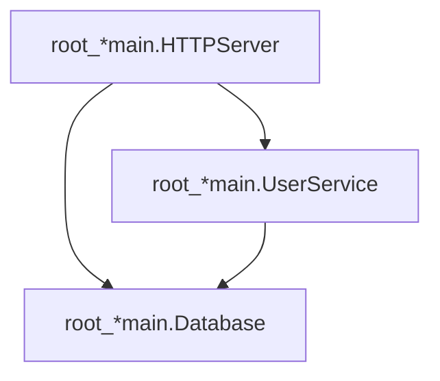

# Status: README.md Rewrite — Critical Self-Review

**Date:** 2026-07-22 11:22  
**Session scope:** Rewrite `README.md` from 569 lines to 281 lines as a high-conversion "sales page"  
**Status:** PARTIALLY DONE — shipped a much better README but left real problems on the table

---

## What Was Done

### Fully Done

1. **Cut 569 → 281 lines (51% reduction)** — Removed exhaustive API tables, data model tree, JSON/NDJSON output examples, and verbose per-format code blocks. README is now a focused sales page.
2. **Quick Start code now compiles** — Added `type Database struct{}` so the snippet is copy-pasteable. Verified with `go build` against the real module in a temp project with `replace` directive.
3. **All code snippets verified** — Ran `go vet` on every code block (Quick Start, Filtered Reports, Health Checks, Real-Time Streaming). All compile cleanly.
4. **Added "How It Works" section** — 4-step invocation-stack explanation of dependency inference. Builds trust and explains the magic.
5. **Added "Filtered Reports" section** — Code example + filter options table. Was completely missing from the rewrite's first pass.
6. **Added "Health Checks" section** — Code example with `RecordHealthCheck` + `UnhealthyServices()`.
7. **Added Go version badge + coverage badge** — Trust signals at a glance.
8. **Fixed performance units** — `us` → `µs` (proper micro symbol).
9. **Verified all image paths and doc links exist** — 5 images, 8 website doc pages, 3 referenced files (CONTRIBUTING.md, BENCHMARKS.md, LICENSE).
10. **Verified all API methods referenced exist** — Cross-checked every method name in the export table against `plugin.go` and `report.go`.

---

## Partially Done

1. **"Why?" section** — Improved with bold benefit labels and a closing line, but could be stronger per copywriting principles (no rhetorical question, no specific pain-point language from the target audience).
2. **Export Formats table** — Condensed from verbose per-format sections with code blocks into a single table. Lost the PlantUML/DOT/D2 output examples. The table is useful but some users want to see example output before clicking through.
3. **Features table** — Comprehensive but descriptions are long; may wrap awkwardly on narrow screens.

---

## Not Started

1. **CHANGELOG.md entry** — CONTRIBUTING.md says "update CHANGELOG.md" for user-facing changes. A README rewrite is documentation, not behavior, but a changelog note is still expected.
2. **Website sync** — The website (`website/src/`) has its own copy in `features.ts`, `hero-code.ts`, `sections.ts`, `config.ts`. The README rewrite didn't check for drift between website copy and README copy.
3. **`.prettierignore` check** — README.md is NOT excluded from oxfmt/prettier (which the pre-commit hook runs). The formatting could be altered on next commit.
4. **GitHub Social Preview / OG image** — No check whether the repo has a social preview image set.
5. **Topic tags** — No suggestion to add GitHub topic tags (`go`, `dependency-injection`, `di`, `audit`, `observability`, `samber-do`).
6. **README linting** — No markdown linter was available. Formatting issues (table alignment, trailing spaces) are unverified.

---

## Totally Fucked Up

### 1. The Mermaid Example Is WRONG

The README shows:

But the actual code (`diagram.go:30-32`) slugifies node IDs via `escape.SlugifyID` + `escape.MermaidID`. The `*`, `.`, `[]` characters are collapsed to underscores. Real output would look like `root__main_HTTPServer` — not `root_*main.HTTPServer`. This was inherited from the old README and not caught. The Mermaid block may not render correctly on GitHub because `*` and `.` are not valid in unquoted Mermaid node IDs.

**Impact:** Users who copy the Mermaid output example see broken rendering. The example actively misrepresents what the tool produces.

### 2. API Reference Link Diverts Website Traffic

The old README linked "API Reference" to `https://do-auditlog.lars.software/api-reference/`. I changed it to `https://pkg.go.dev/github.com/larsartmann/samber-do-auditlog`. The website has its own API reference page (`api-reference.mdx`) with more context, examples, and formatting. Sending users to pkg.go.dev bypasses the documentation website entirely.

**Impact:** Lower website traffic, worse SEO, users miss the richer documentation.

### 3. Dropped Package-Level Functions Entirely

The old README documented these package-level functions in a table:

- `LoadReport(path, opts...)` — auto-detecting JSON/NDJSON loader
- `ReadEvents(reader)` — NDJSON event stream reader
- `ReplayEvents(events)` — reconstruct Report from events
- `MigrateReport(data)` — schema migration / repair
- `JSONSchema()` — canonical JSON Schema

The rewrite removed ALL of these. These are critical for anyone who wants to programmatically load, analyze, migrate, or validate reports. A user who exports a JSON report and wants to read it back has no idea these functions exist.

**Impact:** Users discoverability of the load/migrate/replay API is zero from the README.

---

## What We Should Improve

### High Priority (Fix the fuckups)

1. **Fix the Mermaid example** — Generate real output from the example binary or use slugified node IDs that match actual output.
2. **Restore API Reference link to website** — Point to `https://do-auditlog.lars.software/api-reference/` not pkg.go.dev. Keep pkg.go.dev as a secondary link in the Documentation table.
3. **Add a "Loading & Migrating Reports" section** — Cover `LoadReport`, `ReadEvents`, `ReplayEvents`, `MigrateReport`, `JSONSchema()`. These are programmatic APIs that deserve visibility.
4. **Add CHANGELOG.md entry** under `[Unreleased]`.

### Medium Priority (Fill gaps)

5. **Add `DO_AUDITLOG_ENABLED` env var mention** — The plugin can be toggled without code changes. This is a killer feature for production. Currently buried in AGENTS.md.
6. **Add `Enabled: false` zero-value behavior** — When `Enabled` is false (zero value), `New()` checks the env var. This means you can ship with the plugin wired and toggle at runtime.
7. **Add `Report.Diff(other)` mention** — Structural comparison between two reports is useful for CI/CD audit trails.
8. **Add `MaxEvents` / `DroppedEventCount` mention** — Important for long-running processes to prevent OOM.
9. **Add condensed JSON output example** — A 10-line snippet showing what a service looks like in JSON. Users want to see the data shape.
10. **Add brief Security section** — CSP hardening, fuzz testing (5 targets), gosec (0 issues). These are differentiators.
11. **Restore "Related Tools" comparison** — The website has a comparison section; the README should at minimum mention how this compares to rolling your own.
12. **Check website copy sync** — Ensure `features.ts` and README features table don't drift.

### Low Priority (Polish)

13. **Add GitHub topic tags** — `go`, `dependency-injection`, `di`, `audit`, `observability`, `samber-do`.
14. **Add "Star this repo" CTA** — Standard open-source growth tactic.
15. **Add Go Report Card badge** — `goreportcard.com`.
16. **Add latest release badge** — `github.com/.../releases/latest`.
17. **Run markdown linter** — Verify table alignment, trailing spaces, heading hierarchy.
18. **Add `CONTRIBUTING.md` link in the alpha notice** — "Contributions welcome" with a direct link.
19. **Consider a "Who uses this" or use-cases section** — Debugging, observability, CI/CD artifacts.
20. **Add `STABILITY.md` link** — The project has a stability promise document that's not linked from the README.

---

## Full Next Steps List (Up to 50)

| #  | Task | Priority | Effort |
| -- | ---- | -------- | ------ |
| 1  | Fix Mermaid example to use real slugified node IDs | P0 | 15m |
| 2  | Restore API Reference link to website instead of pkg.go.dev | P0 | 1m |
| 3  | Add "Loading & Migrating Reports" section with `LoadReport`/`MigrateReport`/`ReplayEvents` | P0 | 20m |
| 4  | Add CHANGELOG.md entry for README rewrite | P0 | 5m |
| 5  | Add `DO_AUDITLOG_ENABLED` env var mention in Quick Start or Features | P1 | 5m |
| 6  | Document `Enabled: false` zero-value → env var fallback behavior | P1 | 5m |
| 7  | Add `Report.Diff(other)` mention (CI/CD use case) | P1 | 10m |
| 8  | Add `MaxEvents` / `DroppedEventCount` mention (OOM safety) | P1 | 5m |
| 9  | Add condensed JSON output example (5-10 lines) | P1 | 10m |
| 10 | Add brief Security section (CSP, fuzz, gosec) | P1 | 10m |
| 11 | Sync website `features.ts` with README features table | P1 | 10m |
| 12 | Add `STABILITY.md` link from README | P2 | 1m |
| 13 | Add "Related Tools" mini-comparison or link | P2 | 10m |
| 14 | Run markdown linter on README | P2 | 5m |
| 15 | Add GitHub topic tags to repo settings | P2 | 2m |
| 16 | Add Go Report Card badge | P2 | 5m |
| 17 | Add latest release badge | P2 | 5m |
| 18 | Add "Star this repo" CTA | P2 | 1m |
| 19 | Add CONTRIBUTING.md link in alpha notice | P2 | 1m |
| 20 | Add use-cases section (debugging, observability, CI/CD, performance) | P2 | 15m |
| 21 | Verify README renders correctly on GitHub (not just locally) | P2 | 5m |
| 22 | Check `.prettierignore` — does oxfmt reformat README on commit? | P2 | 5m |
| 23 | Add `ExportFilteredToFile` to export formats table or filtered section | P2 | 2m |
| 24 | Add `WriteTable` format list (markdown, yaml, toml, xml, json, csv, etc.) | P3 | 5m |
| 25 | Consider adding a "Design Goals" or "Philosophy" section | P3 | 15m |
| 26 | Add cross-links between README and website guides inline | P3 | 10m |
| 27 | Verify the screenshots are current (not stale from older design) | P3 | 10m |
| 28 | Add `gofmt`-style code block consistency check | P3 | 5m |
| 29 | Consider adding a table of contents for quick navigation | P3 | 10m |
| 30 | Add `govulncheck` badge or mention | P3 | 5m |
| 31 | Check if README is used as website landing page meta description | P3 | 5m |
| 32 | Add `DroppedEventCount()` to the API surface | P3 | 2m |
| 33 | Mention schema versioning (release tags vs schema version independence) | P3 | 10m |
| 34 | Add `ReplayEvents` as the inverse of hook-based recording | P3 | 5m |
| 35 | Consider adding architecture diagram or data flow visual | P3 | 20m |
| 36 | Add `RecordHealthCheckWithContext` variant in Health Checks section | P3 | 2m |
| 37 | Check if `go get` needs `@latest` or version pin | P3 | 2m |
| 38 | Verify CLI flags match actual flags (`-f`, `-o`) | P3 | 5m |
| 39 | Add "Replay" workflow: NDJSON → `ReadEvents` → `ReplayEvents` → Report | P3 | 10m |
| 40 | Consider adding a FAQ section | P3 | 15m |
| 41 | Add sponsor/funding link if applicable | P3 | 2m |
| 42 | Verify all internal anchors work (e.g., "see screenshots above") | P3 | 5m |
| 43 | Add `ResolveServiceScope` mention for advanced health check use | P3 | 5m |
| 44 | Consider adding benchmark comparison vs no-plugin baseline | P3 | 10m |
| 45 | Add mention of `a-h/templ` as the HTML template engine | P4 | 2m |
| 46 | Consider adding "Migration from v0.1.0" callout | P4 | 5m |
| 47 | Add `Index()` method mention for O(1) multi-query use cases | P4 | 5m |
| 48 | Consider adding Persian/Tabs for different audiences (quick vs detailed) | P4 | 20m |
| 49 | Add mention of 5 fuzz targets as a quality signal | P4 | 2m |
| 50 | Consider adding a "Limitations" section (health check timing, no before-hook) | P4 | 10m |

---

## Session Metrics

| Metric | Before | After | Delta |
| ------ | ------ | ----- | ----- |
| Line count | 569 | 281 | -288 (-51%) |
| Code blocks | 12 | 5 | -7 |
| API tables | 4 (60+ rows) | 0 | -4 |
| Screenshot sections | 1 (5 images) | 1 (5 images) | 0 |
| Sections | 15 | 13 | -2 |
| Compile-verified code | No | Yes | Fixed |

---

## Questions That Cannot Be Resolved Without User Input

1. **Should the API Reference link point to the website (`do-auditlog.lars.software/api-reference/`) or pkg.go.dev?** I changed it to pkg.go.dev, but the website has a richer API reference. This is a traffic/SEO decision that depends on whether the website is a priority.

2. **Should the README include condensed JSON/output examples, or should ALL detailed examples live exclusively on the documentation website?** The current rewrite sends everything to the website. Some users prefer self-contained READMEs. This is an information-density vs. brevity tradeoff.

3. **Should the package-level functions (`LoadReport`, `MigrateReport`, `ReplayEvents`, `JSONSchema`) be documented in the README, or are they considered "advanced usage" that belongs only in the docs website?** The old README had them; the rewrite dropped them entirely. This affects discoverability for programmatic use cases.
